# 大模型核心知识点

1. Prompt Engineering
2. LangChain
3. Fine-tuning

## Prompt Engineering

Prompt(提示/指令)今日内容

- 告诉大模型（ChatGPT）要干什么：讲笑话，聊天
- 怎么能做地更好（如何在代码里面用到这些？如何在垂直场景中用到这些功能？）
- 怎么能用在代码里：（1.单轮问答 2.多轮交互）
- 问题注意

### 如何将Prompt用在代码中（以ChatGPT为例）

1. Step1:安装OpenAI库

2. Step2:生成API key

3. Step3:设定本地的.env文件

4. Step4:代码中的准备工作

5. Step5:可以了，开始吧

6. Step6:看看结果

7. Step7:深入学习，这些参数都是啥

有几个重要的参数需要说明一下：

- model : 选择哪个model，可以进入openai的主页当中，选择相应的模型，主页中有相应的名字，含义等等（ChartGPT默认的model是gpt-3.5-turbo）
- messages=messages 这个messages是一个list，这个就是你跟大模型之间的交互信息（如果是单轮对话的话，就一个prompt）

messages示例： messages : [{'role':'user','content':prompt}]

role: 用来定义交互中的角色 a.user:交互中的“我” b.assistant:交互中的“model” c.system:
交互中“大环境”，最好预先设定，比如告诉模型：“你是一个AI专家，在接下来的互动中，你的回答尽量用专业语言”之类的

- temperature=0 随机性，0的随机性最小（你问10遍，可能10遍的结果都不一样的，感兴趣可以了解后面数学）

8. Step8:深入学习，如何生成多轮对话

利用assistant与system，看实例：仍然是生成课程大纲，但是，我要搞事情

9. Step9:还有什么呢？

我的prompt写的够不够好？不够好？能不能让别人帮我写prompt？

关于Prompt需要注意的

- 内容审核（不是很准，可能是中午关系）

## LangChain

### LangChain是啥？

- 面向大模型的开发框架
- 简单实现复杂功能的AI应用
- 多组件封装

LangChain是一个开源框架，它可以让开发人员把GPT-4这样的大型语言模型（LLM）和外部数据结合起来。

用户可以利用LangChain的模块来改善大语言模型的使用，通过输入自己的知识库来”定制化“自己的大语言模型。

LangChain核心：组件/封装/模块

#### I/O模块

Prompts:主要惯例/协助构建送入model的输入
Language models:用何种model
Output parsers:解析输出结果

1. 大模型I/O模块

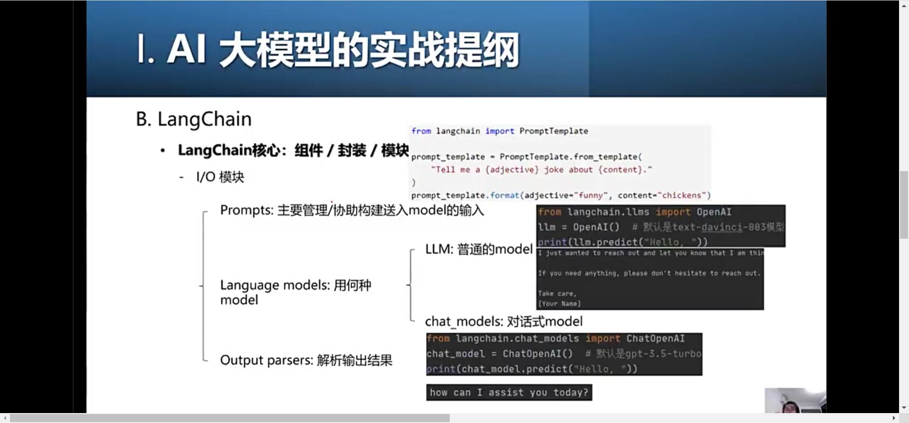

2. IO大模型流程图

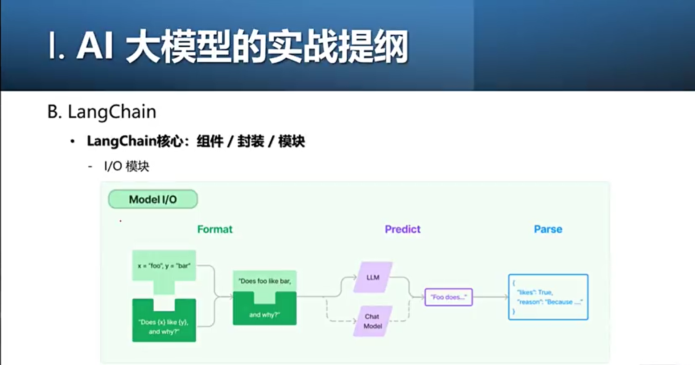

可以看出来，I就是大模型模块的Format，需要把不同的需求格式化、归一化

3. 数据连接模块

- load模块

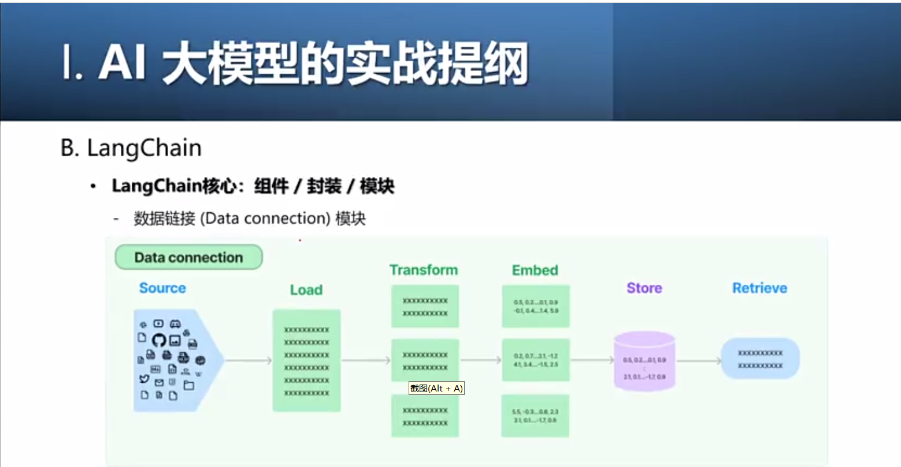

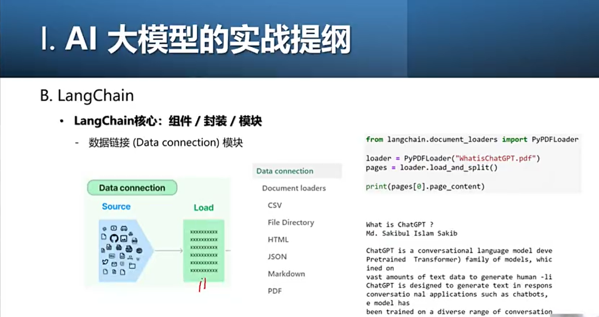

- Transform：做一些数据层面的预处理

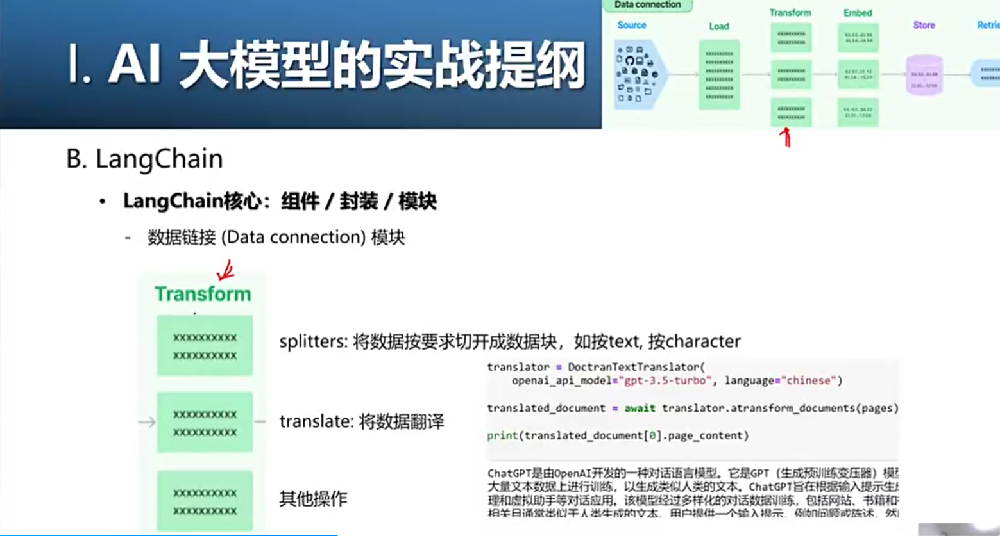

- Embed：把数据转换成人类看不懂的特征向量（“张量”）

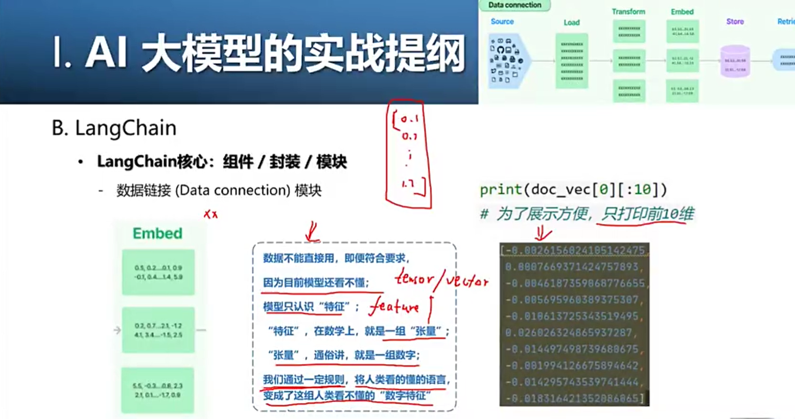

AI有3个层次：

1. 第一个层次（语文）：文学层次或者说是语文层次，人类用听得懂的话描述一件事情
2. 第二个层次（数学）：我们要对刚才说的文学层次进行数学建模（数学层面）
3. 第三个层次（编码）：编码

- 相似度核心原理：“向量”距离

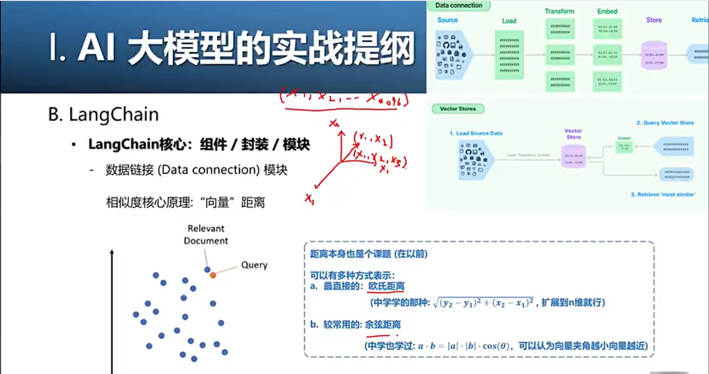

- 记忆（Memory）模块：针对多轮会话强相关

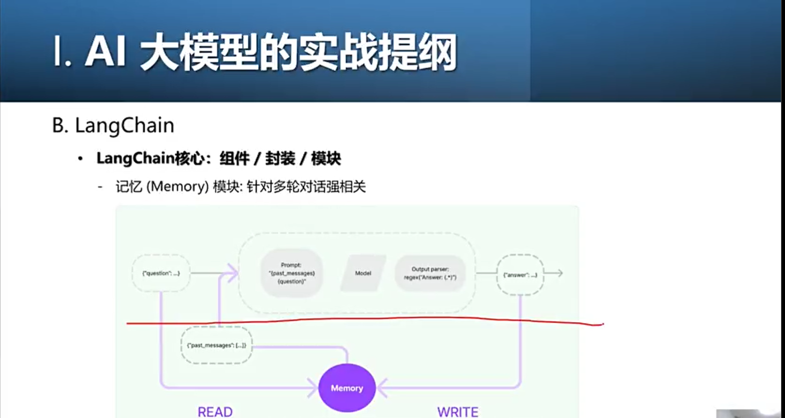

ConversationBufferMemory

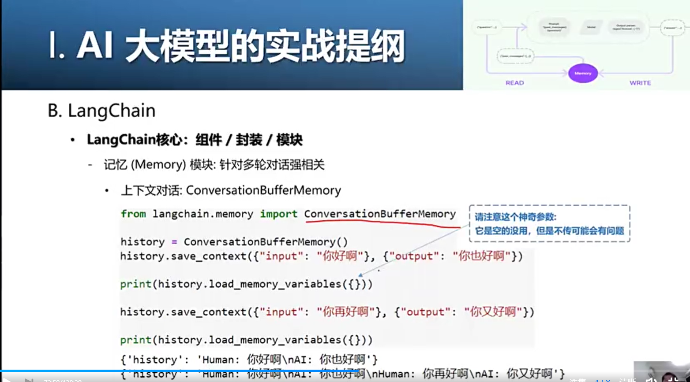

ConversationBufferWindowMemory

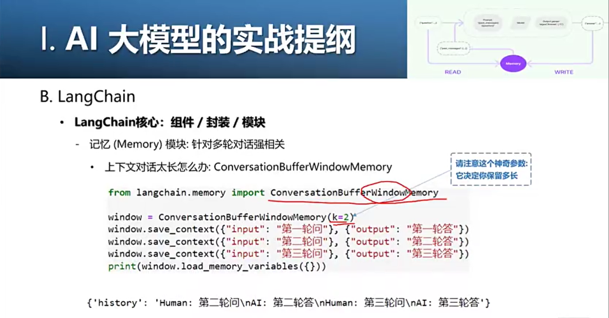

ConversationSummaryMemory:我把你这个对话进行总结，我把总结性的对话记下来

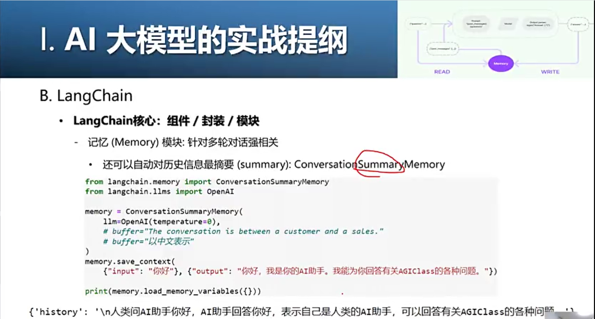

其他的Memory Types:

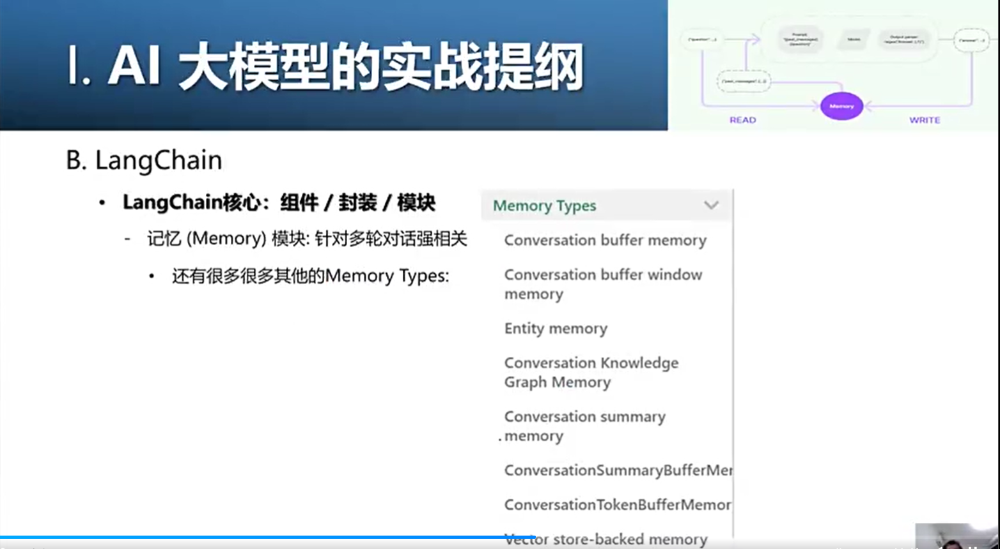

### LangChain总结

LangChain的运作方式，对于程序员来说是一项非常重要的技能，它可以让你的AI开发更加高效和创新

## Fine-tuning

### 何为Fine-tuning（微调）

关于模型训练：

1. from scratch:从头训练
   
   对大模型而言，对一般团队个人：不行
   a.训练周期太长
   b.数据量要求太大
   c.成本太高
2. finetune:微调/接着别人的训练

### 不同的微调

全参数finetune

小参数finetune:Adapters、prompt-tuning（V1,V2）、LORA

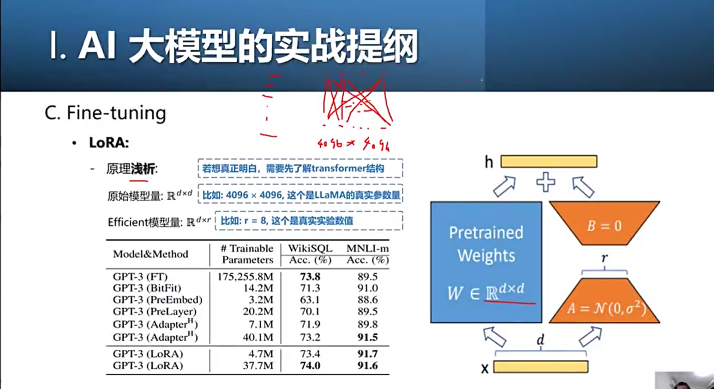

