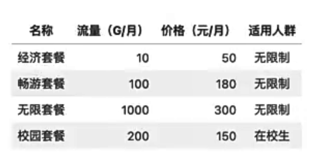
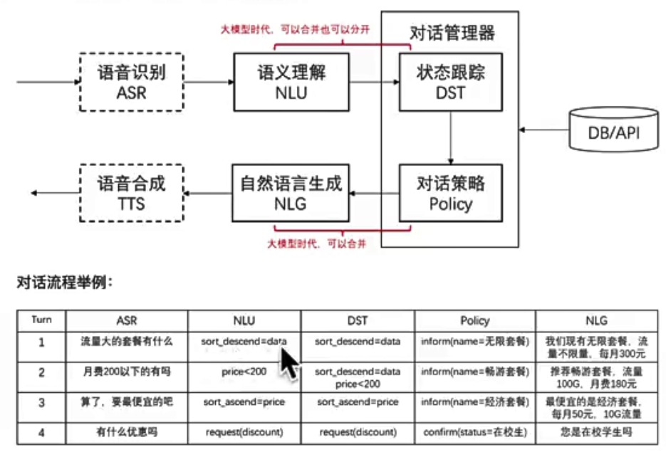

# 前言
这节课会带给你:
1. 了解提示工程的跨时代意义
2. 掌握提示工程的核心方法论
3. 掌握提示调优的基本方法，了解它在实际生产中的应用
4. 掌握防止 prompt 注入的方法，AI更安全

# 1 什么是提示词工程
(PromptEngineering)提示工程也叫「指令工程」
- Prompt 就是你发给大模型的指令，比如「讲个笑话」、「用Python 编个贪吃蛇游戏」、「给男/女朋友写封情书」等。 
- 貌似简单，但意义非凡
  1. "Prompt是 AGI时代的「编程语言」
  2. Prompt 工程是 AGI 时代的「软件工程」
  3. ”提示工程师是 AGI时代的「程序员」
- 学会提示工程，就像学用鼠标、键盘一样，是 AGI时代的基本技能
- 现在提示工程也是「门槛低，落地难」，所以有人戏称prompt为「咒语」
- 但专门的「提示工程师」不会长久，因为每个人都要会「提示工程」，AI的进化也会让提示工程越来越简单，2年后提示工程师可能就没有价值了。

> 思考:如果人人都会，那我们的优势是什么?

## 1.1 我们在「提示工程」上的优势
我们懂「大模型只会基于概率生成下一个字」这个原理，所以知道:
- 为什么有的指令有效，有的指令无效 
- 为什么同样的指令有时有效，有时无效 
- 怎么提升指令有效的概率

我们懂编程:
- 知道哪些问题用提示工程解决更高效
- 哪些用传统编程更高效能完成和业务系统的对接，把效能发挥到极致

## 1.2 使用 Prompt的两种目的
1.**获得具体问题的具体结果**，比如「我该学 Vue 还是 React?」「PHP 为什么是最好的语言?」
2.**固化一套 Prompt到程序中，成为系统功能的一部分**，比如「每天生成本公司的简报」^i客服系统」「基于公司知识库的问答J
前者主要通过 ChatGPT、ChatALL这样的界面操作。后者就要动代码了。我们会专注于后者，因为:
1. 后者更难，掌握后能轻松搞定前者
2. 后者是我们的独特优势

## 1.3 Prompt 调优
找到好的 prompt 是个持续选代的过程，需要不断调优。
如果知道训练数据是怎样的，参考训练数据来构造 prompt是最好的。「当人看」类比:
1. 你知道 ta 爱让灯楼梦，就和 ta 聊红楼梦
2. 你知道 ta 十年老阿里，就多说阿里黑话
3. 你知道 ta 是日漫迷，就夸 ta 卡哇伊

不知道训练数据怎么办?

1.看 Ta 是否主动告诉你。例如已知:OpenAlGPT对Markdown 格式友好，Claude（OpenAI离职的人创建的）对XML 友好。
2.只能不断试了。

「试」是常用方法，确实有运气因素，所以「门低、落地难」。

高质量 prompt 核心要点:
> 划重点：具体、丰富、少二义性

思考：如果底层大模型换了，prompt要不要重新调优？
如果换了模型，如换成文心一言了，要重新训练的，需要重新调一遍prompt

# 2. Prompt的典型构成
- **角色**:给 AI定义一个最匹配任务的角色，比如:「你是一位软件工程师」「你是一位小学老师」
- **指示**:对任务进行描述
- **上下文**:给出与任务相关的其它背景信息(尤其在多轮交互中)
- **例子**:必要时给出举例，学术中称为 one-shot learning,few-shot learning或 in-contextlearning;实践证明其对输出正确
性有帮助
- **输入**:任务的输入信息;在提示词中明确的标识出输入
- **输出**:输出的格式描述，以便后继模块自动解析模型的输出结果，比如(JSON、XML)

「定义角色」其实本来是非必要的，完全是大家「把A1当人看」玩出的一个用法。但因为实在传得太广了，所以现在的大模型在训练数据里基本心有这个了。

但是有一个已经被论文证实的现象，可以说明为啥「你是一个xxx」有效:

> 大模型对 prompt 开头和结尾的内容更敏感

所以，先定义角色，其实就是在开头把问题域收窄，减少二义性。

## 2.1 设定一个业务场景来讲解上述知识
业务场景:办理流量包的智能客服
流量包产品:


## 2.2 对话系统的基本模块（简介）



## 2.3 用 Prompt 实现上述模块功能
环境搭建
调试 prompt 的过程其实在图形界面里开始会更方便，但为了方便演示和大家上手体验，我们直接在代码里调试
```python
# 加载环境变量
import openai
import os
from doteny import load dotenv, find dotnv=load_dotenv(find_dotenv()) #读取本地 .env 文件，里面定义了 OPENAI_API_KEY

openai.api key=os.getenV('OPENAI API KEY")
```

```python
#基于prompt 生成文本
def get_completion(prompt, model="gpt-3.5-turhh"):
   messages =[{"role":"user","content": prompt}]
   response =openai.ChatCompletion.create(
      model=model,
      messages=messages
      temperature=0，#模型输出的随机性，0表示随机性最小
)
return response.choices [0].message["content"]
```

### 2.3.1 实现一个NLU
任务描述+输入，以下是一个prompt模块化的示例
```python
# 任务描述
instruction="""
你的任务是识别用户对手机流量套餐产品的选择条件。
每种流量套餐产品包含三个属性:名称，月费价格，月流量。
根据用户输入，识别用户在上述三种属性上的倾向。
"""

#用户输入
input_text = """
办个100G的套餐
"""

# prompt 模版
prompt =f"""
{instruction}

用户输入:
{input text}
"""

response =get completion(prompt)
print(response)
```

用户在流量套餐产品的选择条件上的倾向为:
-名称:用户倾向选择100G的套餐。
-月费价格:用户未提及对月费价格的倾向。
-月流量:用户倾向选择100G的套餐。

**约定输出格式**
```python
# 输出描述
output format ="""
以JSON格式输出
"""

# 稍微调整下咒语
prompt =f"""
{instruction}

{output_format}

用户输入:
{input_text}
"""

response = get_completion(prompt)
print(response)
```

```json
{
  "名称":"100G套餐",
  "月费价格":"未知",
  "月流量":"100G"
}
```

**注：**
- 加上各种各样的指令，不如写个例子效果好
- 一切问题先尝试用prompt解决，往往有四两拨千斤的效果

### 2.3.2 实现上下文DST
在prompt中加入上下文
```
instruction="""
你的任务是识别用户对手机流量套餐产品的选择条件。
每种流量套餐产品包含三个属性:名称(name)，月费价格(price)，月流量(data)。
根据对话上下文，识别用户在上述属性上的倾向。识别结果要包含整个对话的信息。
"""

# 输出描述
output format ="""
以JSON格式输出。
1.name字段的取值为string类型，取值必须为以下之一:经济套餐、畅游套餐、无限套餐、校园套餐 或 null;

2. price字段的取值为一个结构体 或 null，包含两个字段:(1)operator，string类型，环值范围:'<='(小于等于)，'>='(大于等于)，'='(等于)(2)value，int类型

3.data字段的取值为取值为一个结构体 或 null，包含两个字段:
(1)operator，string类型，取值范围:'<='(小于等于)，'>='(大于等于)，'='(等于)
(2)value，int类型或string类型，string类型只能是'无上限'

4.用户的意图可以包含按price或data排序，以sort字段标识，取值为一个结构体:
(1)结构体中以"ordering"="descend"表示按降序排序，以"'value"字段存储待排序的字段
(2)结构体中以"ordering"="ascend"表示按升序排序，以"value"字段存储待排序的字段

只输出中只包含用户提及的字段，不要猜测任何用户未直接提及的字段，不要输出值为null的字段
"""

# DO NOT OUTPUT NULL-VALUED FIELD!
examples = """
客服:有什么可以帮您
用户:100G套餐有什么

{"data":{"operator":">=","value":100}}

客服:有什么可以帮您
用户:100G套餐有什么
客服:我们现在有无限套餐，不限流量，月费300元
用户:太贵了，有200元以内的不

{"data":{"operator":">=","value" :100},"price" :{"operator" :"<=","value":200}}

客服:有什么可以帮您
用户:便宜的套餐有什么
客服:我们现在有经济套餐，每月50元，10G流量
用户:100G以上的有什么

{"data": {"operator" :">=","value":100},"sort": {"ordering" "ascend" , "value" "price"}}
客服:有什么可以帮您
用户:100G以上的套餐有什么
客服:我们现在有畅游套餐，流量100G，月费184元

{"sort" : {"ordering"="descend" , "value"="data"},"data":{"operator":">=","value":100}}

# input_text-"哪个便宜
# input text="无照量哪个多少钱input_text ="流量最大的多少钱’

context = f"""
客服:有什么可以帮您
用户:有什么100G以上的套餐推荐
客服:我们有畅游套餐和无限套餐，您有什么价格倾向吗
用户:{input text}
"""

prompt=f"""
{instruction}

{output format}

{examples}

{context}
"""

response = get_completion(prompt)

```

(1)用Prompt实现DST不是唯一选择
优点: 节省开发量。
缺点: 调优相对复杂，最好用动怎例子(讲Embedding时再review这个点)

(2)也可以用Prompt实现NLU，用传统方法维护DST
优点: DST环节可控性更高。
缺点: 需要结合业务know-how设计状态更新机制(解冲突)

### 2.3.3 实现NLG和对话策略
我们先把刚才的能力串起来，构建一个[简单]的客服机器人
```
# 加载环境变量
import openai
import os
import json
import copy

from dotenv import load dotenv, find dotenv=load_dotenv(find dotenv())#读取本地.env 文件，里面定义了 OPENAI API KEY

openai.api key= os.getenV('OPENAI API KEY")

instruction ="""
你的任务是识别用户对手机流量套餐产品的选择条件。
每种流量套餐产品包含三个属性:名称(name)，月费价格(price)，月流量(data)。
根据用户输入，识别用户在上述三种属性上的倾向。
"""


```

进度：01:10


# 下载安装
https://blog.csdn.net/weixin_49131823/article/details/131216453
启动
```shell
jupyter notebook
```