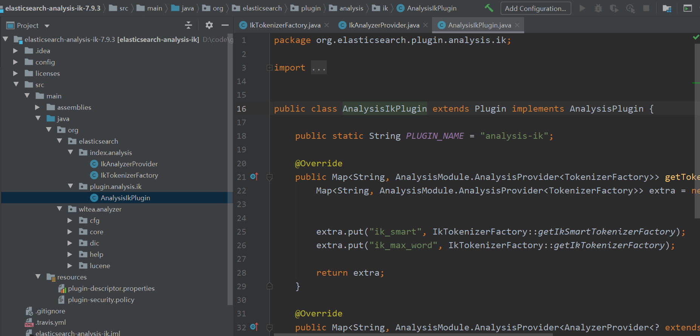
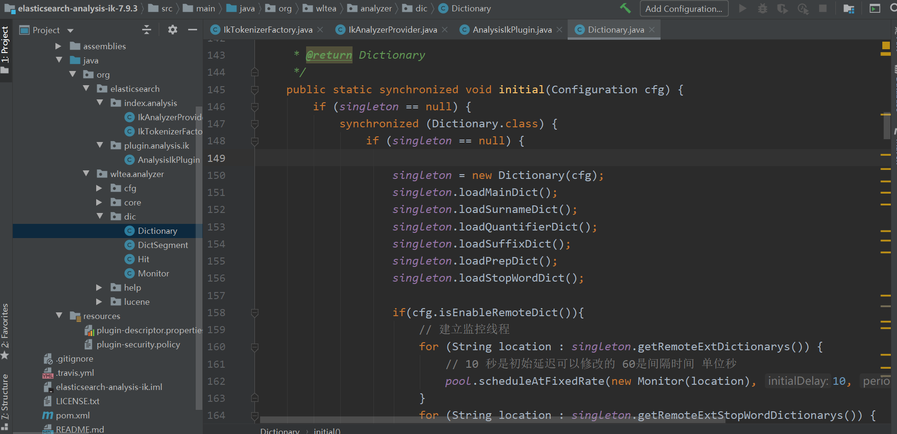

# 前言
> 原生开源的IK分词器不好用，我们都需要对IK分词器做一些改造，源码二次开发和调整改造，实现词库热刷新机制。这样IK中文分词器，就可以从我们
  自定义的数据库里初始化的时候加载词库，开启一个后台线程，定时从数据库里刷新和加载最新词库，如果我们想要更新词库，在web界面里手工录入
  最新词语、系统灌入最新的词汇，数据库，ES jvm进程里->IK中文分词器代码->不断的自己热加载数据库里最新的词汇和热刷新

# 源码改造
- 源码下载

下载elasticsearch-analysis-ik源码，版本7.9.3，下载地址:https://github.com/medcl/elasticsearch-analysis-ik/archive/refs/tags/v7.9.3.zip

- 将源码导入到idea中

- 确定需要改造的代码
在org.wltea.analyzer.dic.Dictionary#initial中，这个方法会加载ik分词器配置文件中的词库内容，如下：

- 增加DictLoader类
  
- 将Dictionary类中的getDictRoot方法改为public供DictLoader调用

- 将Dictionary类中添加一个addStopWords方法
  停用词，stop words，没有太大意义的词汇，the a 没什么词汇，中文，的 了 呵，分词可以忽略掉的一些没意义的词汇，停用词
  
- 在Dictionary#initial⽅法中开启⼀个加载词库的线程
  代码位置：org.wltea.analyzer.dic.Dictionary#initial

