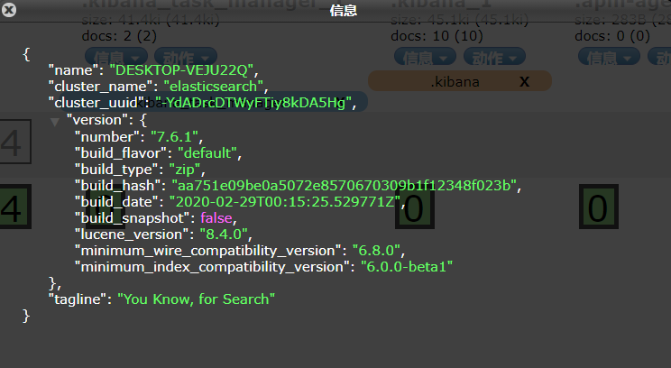
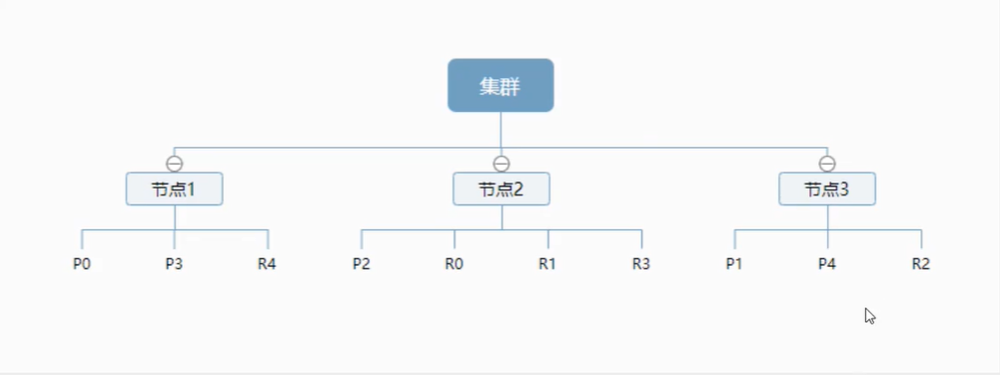

@[TOC](目录)
# 什么是ElasticSearch
 - 基于Apache Lucene构建的开源搜索引擎
 - 采用Java编写，提供简单易用的RESTFul API
 - 轻松的横向扩展（增加节点数），可支持PB级别的结构化或者非结构化数据
 - 在elasticsearch中，索引被分为多个分片，每份分片是一个Lucene的索引。
 
# lucene和elasticsearch的关系
lucene，最先进、功能最强大的搜索库，直接基于lucene开发，非常复杂，api复杂（实现一些简单的功能，写大量的java代码），需要深入理解原理
（各种索引结构）elasticsearch，基于lucene，隐藏复杂性，提供简单易用的restful api接口、java api接口（还有其他语言的api接口）
- 分布式的文档存储引擎
- 分布式的搜索引擎和分析引擎
- 分布式，支持PB级数据
开箱即用，优秀的默认参数，不需要任何额外设置，完全开源

#  ES的应用场景
 - 海量数据分析引擎（可利用es的聚合搜索功能来解决）
 - 站内搜索引擎
 - 数据仓库（ES具有强大的分布式数据处理能力，存储Pb级别的结构化或者非结构化数据）
 
# es的核心概念
## 1. Near Realtime（NRT）
近实时，两个意思：
- 从写入数据到数据可以被搜索到有一个小延迟（大概1秒）
- 基于es执行搜索和分析可以达到秒级

## 2.cluster（集群）
一个集群就是由一个或多个es节点组织在一起，它们共同持有整个的数据，并一起提供索引和搜索功能，一个集群由一个唯一的名字标识，这个名字默认
就是“elasticsearch”,多个节点使用这个名字加入集群、每个节点都有自己的名字，集群是通过集群的名字来加入一个集群的。另外，每一个集群节点
都有它自己的名字。如上节中所讲的，master、salve1、slave2等。

## 3.node（节点）
一个节点是集群中的一个es实例，作为集群的一部分，它存储你的数据，参与集群的索引和搜索功能，和集群类似，一个节点也是由一个名字来标识，
默认情况下，不配置会使用随机名称

## 4.Index（索引）
一个索引就是一个拥有相似特征的文档集合（类似mysql的数据库），一个索引由一个名字来标识，我们对索引中的文档进行索引、搜索时都需要用到
这个名字

## 5.type(类型)
一个索引中，可以定义一个或多个类型，一个类型相当于索引的一个分类（类似mysql的表）

## 6.document(文档)
一个文档是一个可被索引的基础信息单元（类似表中的一行记录），它是最小的存储单元，比如说一个用户的基本信息，一篇文章的数据等等，文档以
json格式来表示。

## 7.Mapping（映射）
Mapping是对类型中的文档中的每个字段进行预先定义数据类型等功能，如定义文档中的某个字段为整形，使用什么分析器，是否可搜索等，一个索引可
以定义多个mapping

## 8.Shards （分片）
Shard代表索引分片，es可以把一个完整的索引分成多个分片保存到不同的节点上，这样的好处是可以把一个大的索引拆成多个，分布到不同的节点上。
有了shard就可以横向扩展，存储更多数据，让搜索和分析等操作分布到多台服务器上去执行，提升吞吐量和性能。每个shard都是一个lucene indexes
构成分布式搜索。**分片的数量只能在索引创建前指定，索引创建或不能修改**

## 9.Replicas（副本）
代表索引副本，可以对一个分片设置多个副本，副本的作用是提高系统的容错性，当每个节点某个分片损坏或丢失时可以从副本中恢复，
二是提供es的搜索效率，es会对搜索请求进行负载均衡。当一个主分片失败或者出现问题时，代替的分片就会代替其工作，从而提高了es的可用性，那么备份的分片还可以支持搜索操作，以分摊搜索的压力。
es在创建索引时，会创建5个分片，一份备份，这个数量是可以修改的，**备份是可以动态修改的**。

任何一个服务器随时可能故障或宕机，此时shard可能就会丢失，因此可以为每个shard创建多个replica副本。replica可以在shard故障时提供备用服务
，保证数据不丢失，多个replica还可以提升搜索操作的吞吐量和性能。primary shard（建立索引时一次设置，不能修改，默认5个），replica shard
（随时修改数量，默认1个），默认每个索引10个shard，5个primary shard，5个replica shard，最小的高可用配置，是2台服务器。

# 物理设计
## 一个人就是一个集群
es在后台把每个索引划分成多个分片，每份分片可以在集群中的不同服务器间迁移。
一个人就是一个集群！默认的集群名称就是elasticsearch。


## 节点和分片如何工作
默认分片是5个，创建副本是1个，意思就是我们存的数据通过这个分片可以搭到不同的节点上，一个集群至少有一个节点，而一个节点就是一个es进程，
节点可以有多个索引默认的，如果你创建索引，那么索引将会有5个分片（primary shard，又称为主分片）构成的，每一个主分片会有一个副本
（replica shard,又称复制分片）如下：


 下图是一个有3个节点的集群，可以看见主分片和对应的副本分片都不会在同一节点内，这样的好处在于某一个节点挂了，数据不至于丢失。实际上，一个分片是一个Lucene索引，一个包含**倒排索引**的文件目录，倒排索引的结构使得es在不扫描全部文档的情况下，就能告诉你哪些文档包含特定的关键词。



# ElasticSearch VS Solr
- Solr 利用 Zookeeper 进行分布式管理，而 Elasticsearch 自身带有分布式协调管理功能;
- Solr 支持更多格式的数据，而 Elasticsearch 仅支持json文件格式；
- Solr 官方提供的功能更多，而 Elasticsearch 本身更注重于核心功能，高级功能多有第三方插件提供；
- Solr 在传统的搜索应用中表现好于 Elasticsearch，但在处理实时搜索应用时效率明显低于 Elasticsearch。
- Solr 是传统搜索应用的有力解决方案，但 Elasticsearch 更适用于新兴的实时搜索应用。

# es的RESTFul API
 - API的基本格式http://<ip>:<port>/<索引>/<类型>/<文档id>
 - 常用HTTP动词GET/PUT/POST/DELETE

 ## 索引创建
 索引的创建主要分结构化和非结构化创建
 ### 结构化创建
 点击索引->新建索引，输入book，默认分片数为5，副本数为1，然后再到概览里面就可以看见我们创建的book索引了，粗线框是主分片，而细线框是粗线线框的备份分片。
 ### 非结构化创建
 索引的创建分为结构化和非结构化，那么如何区分结构化和非机构化的呢？在Head插件页面上点击信息->索引信息，可以看见一个关键词mappings，这关键词如果为空的，那么就为非结构化的索引。
创建结构化索引，在复合查询中，输入book/novel/_mappings，指定json结构：
```
{
	"novel": {
		"properties": {
			"title": {
				"type": "text"
			}
		}
	}
}
```
提交一下请求，会显示创建成功
```json
{
	"acknowledged":true
}
```
然后再点击首页的索引信息，就可以看见mappings就不是空的了
```
"mappings":
```
## postman模拟
采用postman提交索引的新建
PUT  127.0.0.1:9200/people
```json
{
	"settings ": {
		"number_of_shards": 3,
		"number_of_replicas": 1
	},
	"mappings": {
		"man": {
			"properties": {
				"name": {
					"type": "text"
				},
				"country": {
					"type": "integer"
				},
				"age": {
					"type": "date",
					"format": "yyyy-MM-dd HH:mm:ss||yyyy-MM-dd||epoch_millis"
				}
			}
		},
		"woman": {

		}
	}
}
```
然后可以到head插件里面就可以看见刚才创建的people索引信息了
# es的基本操作
## 插入
es的插入分为两种，指定文档id插入和自动产生文档id插入
### 指定文档id插入
我们在postman中插入：
PUT 127.0.0.1:9200/people/man/1
**Body**
```json
{
	"name": "keweizhou",
	"country": "china",
	"age": 30,
	"date": "1987-03 -07"
}
```

 - head插件里面的docs代表所有文档值
 - 点击head里面的数据浏览就可以看见我们刚才插入的值了
### 自动产生文档id插入
不加id采用POST方式提交，es默认会自己帮你生成一个id，而不是我们指定的那个id
## 修改
### 指定文档id修改文档
针对文档id为1的进行修改
POST  127.0.0.1:9200/people/man/1/_update
**body**
```json
{
	"script": {
		"lang": "painless",
		  "inline":"ctx._source.age+=10"
	}
}
```
还可以通过参数的形式修改数据，如
```json
{
	"script": {
		"lang": "painless",
		"inline": "ctx._source.age+=params.age",
		"params": {
			"age": 100
		}
	}
}
```
然后我们去head插件里面就可以看见修改的数据了
ctx代表es的上下文，._source代表es的文档
## 删除
### 删除文档
进入postman，调用：DELETE 127.0.0.1:9200/people/man/1
### 删除索引
删除索引有两种方法
 - 在head插件里面，动作下面有个删除的按键，然后点击删除，就可以将其删除了
 - 或者在postman中调用  DELETE 127.0.0.1:9200/people，就可以将索引删除了

 ## 查询
 ### 简单查询
通过id为1查询当条记录：GET   127.0.0.1:9200/book/novel/1
### 条件查询
POST  127.0.0.1:9200/book/_serarch
查询所有的数据，body为：
```json
{
	"query": {
		"match_all": {}
	}
}
```
查询标题为elasticsearch的书籍：
```json
{
	"query": {
		"match": {
			"title": "elasticserarch"
		}
	}
}
```
也可以在后面加上条件限制
```
"from":1,
"size":1
```
指定排序字段和排序类型(默认升序排列的)：
```
{
	"sort": [{
		"publish_date": {
			"order": "desc"
		}
	}]
}
```
### 聚合查询
aggs是聚合查询的关键词，可以按照这些字段进行聚合统计
```json
{
	"aggs": {
		"group_by_word_count": {
			"terms": {
				"field": "word_count"
			}
		},
		"group_by_publish_date": {
			"terms": {
				"field": "publish_date"
			}
		}
	}
}
```
对word_count进行数学计算
```json
{
	"aggs": {
		"grades_word_count": {
			"stats": {
				"field": "word_count"
			}
		}
	}
}
```
也可以将stats换成min、max等等进行数学计算
### 高级查询
##### 子条件查询（叶子条件查询）
特定字段查询所指特定值，它可以分为Query context和Filter context
###### Query context
在查询过程中，除了判断文档是否满足查询条件外，ES还会计算一个_score来标识匹配的程度，旨在判断目标文档和查询条件匹配的有多好。
**常用查询分为全文本查询和字段级别查询**
普通字段匹配找出作者是keweizhou的用户，但是用到习语就会有问题，比如我查询java开发这个习语，就会把所有和java以及开发的都找出来，那么这个就不行了，要将match换成match_phrase
POST  127.0.0.1:9200/book/_search
```json
{
	"query": {
		"match": {
			"author": "keweizhou"
		}
	}
}
```
查询习语
```json
{
	"query": {
		"match_parase": {
			"title": "java开发"
		}
	}
}
```
 - **全文本查询：** 针对文本类型数据
 - **字段级别查询：** 针对结构化数据，如数字，日期等

复合查询是以一定逻辑组合子条件查询，如：
查询author和title字段中包含张三的数据，语法查询经常在kibana中用
POST    127.0.0.1:9200/book/_search
```json
{
	"query": {
		"multi_match": {
			"query": "张三",
			"fields": ["author", "title"]
		}
	}
}
```
**语法查询**
POST    127.0.0.1:9200/book/_search
查询出Elasticsearch和大法的信息
```json
{
	"query": {
		"query_string": {
			"query": "Elasticsearch AND 大法"
		}
	}
}
```
查询Elasticsearch和大法或者Python相关的
```json
{
	"query": {
		"query_string": {
			"query": "(Elasticsearch AND 大法) OR Python"
		}
	}
}
```
利用query_string查询多个字段：
```json
{
	"query": {
		"query_string": {
			"query": "张三 OR Elasticsearch",
			"fields": ["title", "author"]
		}
	}
}
```
**结构化查询（按照一些字段的查询）：**
POST    127.0.0.1:9200/book/_search
如查询word_count字段等于1000的信息
```json
{
	"query": {
		"term": {
			"word_count": 1000
		}
	}
}
```
查询书籍字数(word_count)在1000~2000之间的
```json
{
	"query": {
		"range": {
			"word_count": {
				"gte": 1000,
				"lte": 2000
			}
		}
	}
}
```
**注意：** 其中的e代表equals的意思，>=或者<=中的等于，它还可以用于日期类型上
###### Filter context
在查询过程中，只判断该文档是否满足条件，只有Yes或者No，主要是做数据过滤的，将符合条件的数据过滤出来。
POST    127.0.0.1:9200/book/_search
```json
{
	"query": {
		"bool": {
			"filter": {
				"term": {
					"word_count": 1000
				}
			}
		}
	}
}
```
##### 复合条件查询
常用查询为固定分数查询、布尔查询
##### 固定分数查询
POST 127.0.0.1:9200/_search
boot为指定分数为2，最后查询出来的score都是2
```json
{
	"query": {
		"constant_score": {
			"filter": {
				"match": {
					"title": "ElasticSearch"
				}
			},
			"boot": 2
		}
	}
}
```
should是一个或的关系，只要满足其中的一个就行了。如何想要得到与的关系，那么必须将should关键词换成must
```json
{
	"query": {
		"bool": {
			"should": [{
					"match": {
						"author": "张三"
					}
				},
				{
					"match": {
						"title": "ElasticSearch"
					}
				}
			]
		}
	}
}
```
还可以配合着filter一起使用，如:
```json
{
	"query": {
		"bool": {
			"must": [{
					"match": {
						"author": "张三"
					}
				},
				{
					"match": {
						"title": "ElasticSearch"
					}
				}
			],
			"filter": [{
				"term": {
					"word_count": 1000
				}
			}]
		}
	}
}
```
它还有一个关键词就是must_no，它的意识和must正好想法，代表的意思就是一定不相等的意思。


参考： [https://github.com/nuptkwz/notes/tree/master/technology/elasticsearch](https://github.com/nuptkwz/notes/tree/master/technology/elasticsearch)