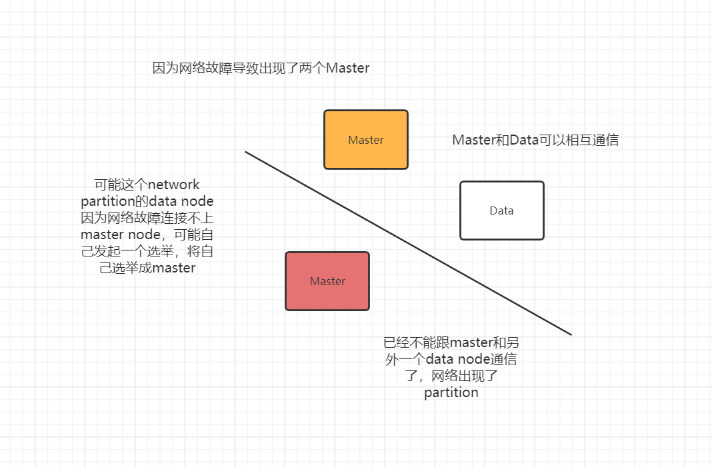
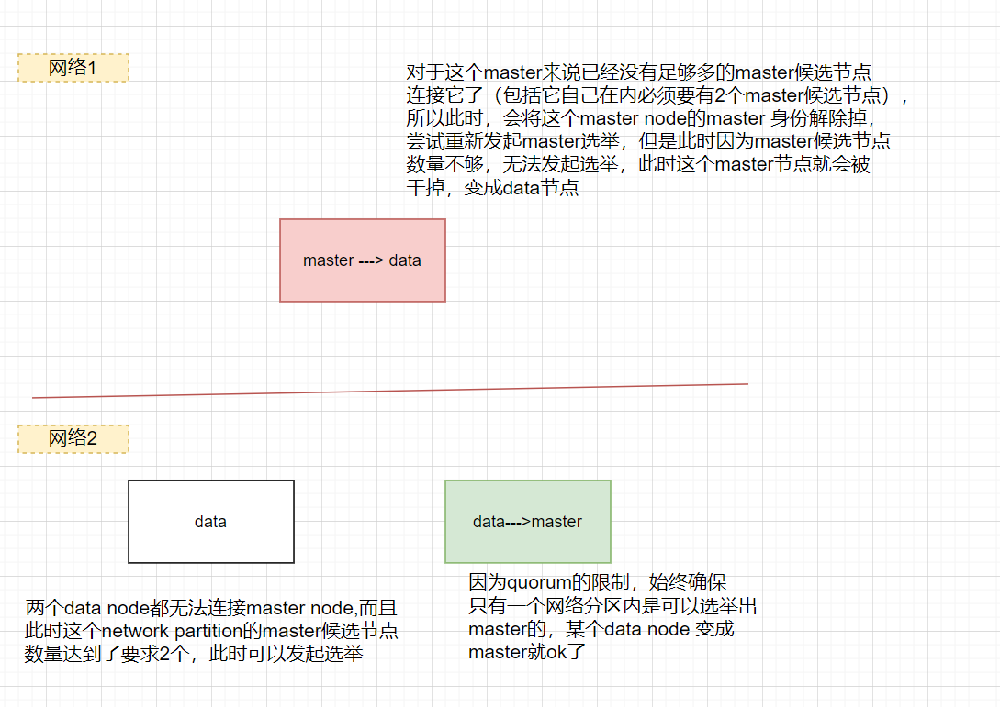
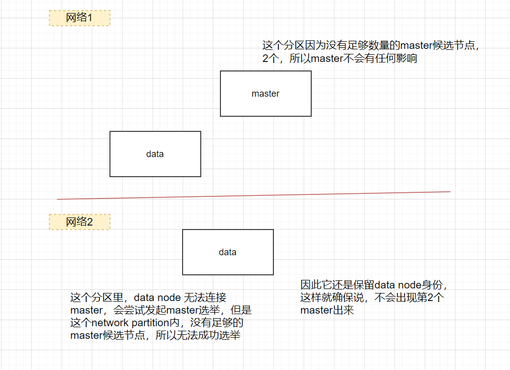

@[TOC]
# 前言
> 本文主要介绍了es的一些目录结果，以及在Linux下es单机与集群的部署。

# 环境
 - elasticsearch-7.9.3-linux-x86_64.tar.gz
 - jdk-8u321-linux-x64.tar.gz
 - CentOS-7-x86_64-Minimal-1908.iso
 - 其他依赖 NodeJs(6.0以上)

# es下载、目录结构、集群发现机制
## es下载
打开es的官网的下载页面：[https://www.elastic.co/downloads/elasticsearch](https://www.elastic.co/downloads/elasticsearch)，
下载，本文中选用的版本是7.9.3。
- 切换到/usr/local目录下，进行下载
```
cd /usr/local/
wget https://artifacts.elastic.co/downloads/elasticsearch/elasticsearch-7.9.3-linux-x86_64.tar.gz
```

- 解压
```
tar -zxvf elasticsearch-7.9.3-linux-x86_64.tar.gz
```

- 重命名目录elasticsearch
```
mv elasticsearch-7.9.3-linux-x86_64 /usr/local/elasticsearch
```

- 删除原有安装包
```
rm -rf elasticsearch-7.9.3-linux-x86_64.tar.gz
```

- 测试一下是否可以访问
启动es: cd到刚才解压的目录下运行  sh ./bin/elasticsearch ，它会打印一些日志，当我们看见started的时候，es就正常启动了。打开浏览器，
输入127.0.0.1:9200我们可以看见es的服务正常启动了。

## es目录结构
elasticsearch目录结构：


主要功能：
- bin：存放es的一些可执行脚本，比如用于启动进程的elasticsearch命令，以及用于安装插件的elasticsearch-plugin插件
- config：用于存放es的配置文件，比如elasticsearch.yml
- lib : 依赖的第三方库目录
- data：用于存放es的数据文件，就是每个索引的shard的数据文件（刚解压下来还没有）
- logs：用于存放es的日志文件
- plugins：用于存放es的插件，如IK、pingyin分词器等
- script：用于存放一些脚本文件

## zen discovery集群发现机制
## 集群发现机制机制介绍
多台机器上，每台集群部署一个es进程，那么多个es进程是如何相互发现对方，然后组成一个集群的呢？下面介绍了一下es集群发现机制。

默认情况下，es进程会绑定在自己的回环地址上，也就是127.0.0.1，然后扫描本机上的9300~9305端口号，尝试跟那些端口上启动的其他es进程进行
通信，然后组成一个集群。这对于在本机上搭建es集群的开发环境是很方便的。但是对于生产环境下的集群是不行的，需要将每台es进程绑定在一个非
回环的ip地址上，才能跟其他节点进行通信，同时需要使用集群发现机制来跟其他节点上的es node进行通信。

在生产环境中的多台机器上部署es集群，就涉及到了es的discovery机制，也就是集群中各个节点互相发现然后组成一个集群的机制，同时discovery
机制也负责es集群的master选举。

es中主要有master node和data node两种角色，es是一种peer to peer，也就是p2p点对点的分布式系统架构，不是hadoop生态普遍采用的那种
master-slave主从架构的分布式系统。集群中的每个node是直接跟其他节点进行通信的，而不是hadoop生态系统中的那种master-slave分布式系统架构。
几乎所有的API操作，比如index，delete，search等，都不是client跟master通信，而是client跟任何一个node进行通信，那个node再将请求转发给
对应的node来进行执行。

正常情况下，就只有一个master node。master node的责任就是负责维护整个集群的状态信息，也就是维护集群的一些元数据信息，同时在node加入
集群或者从集群中下线了一个节点或者重新分配shard，或者是创建或删除了一个索引。包括每次cluster state如果有改变的化，那么master都会负
责将集群状态同步给所有的node。master node负责接收所有的cluster state相关的变化信息，然后将这个改变后的最新的cluster state推动给
集群中所有的data node，集群中所有的node都有一份完整的cluster state。只不过master node负责维护而已。其他的node，除了master之外
的node，就是负责数据的存储和读写的，包括写入索引、搜索数据等等，其他的node叫做data node，也叫数据节点。

如果要让多个node组成一个es集群，首先第一个要设置的参数，就是cluster.name，因为多个node的cluster.name如果一样，才满足组成一个集群
的基本条件。这个cluster.name的默认值是elasticsearch，在生产环境中，一定要修改这个值，否则可能会导致未知的node无端加入集群，造成集
群运行异常。而es中默认的discovery机制，就是zen discovery机制。

zen discovery机制提供了unicast discovery集群发现机制，集群发现时的节点间通信是依赖的transport module，也就是es底层的网络通信模块
和协议。es默认配置为使用unicast集群发现机制，以让经过特殊配置的节点可以组成一个集群，而不是随便哪个节点都可以组成一个集群。但是默认
配置下，unicast是本机，也就是localhost，因此只能在一台机器上启动多个node来组成一个集群。虽然es还是会提供multicast plugin作为一个
发现机制，但是已经不建议在生产环境中使用了。虽然我们可能想要multicast的简单性，就是所有的node可以再接收到一条multicast ping之后就
立即自动加入集群。但是multicast机制有很多的问题，而且很脆弱，比如网络有轻微的调整，就可能导致节点无法发现对方。因此现在建议在生产环境
中用unicast机制，提供一个es种子node作为中转路由节点就可以了。

## master node、data node、network.host
给集群规划出专门的master node，master node 主要有三个概念:master node（主节点），master eligible node（master候选节点），
data node（数据节点），配置的时候，是配置多个node变成master eligible node，但是只是说，从这些master eligible node选举一个node出来
作为master node，其他master eligible node只是接下来有那个master node故障的时候，接替他的资格，但是还是作为data node去使用的，一般
建议master eligible node给3个即可：
```
node.master: true
node.data: false
```
如果配置了node.master: true，node.data: false，那么它只能作为master候选节点而不能作为数据节点来存取数据，和索引的东西。剩下的node
如果只想他作为数据节点，那么可以设置为：
```
node.master: false
node.data: true
```

但是如果一个小集群，就10个以内的节点，那就所有节点都可以作为master eligible node以及data node即可，超过10个node的集群再单独拆分
master和data node吧，如果你的节点数量小于10个，小集群，那所有的node，就不要做额外的配置了，master eligible node，同时也是data node
默认情况下，es会将自己绑定到127.0.0.1上，对于运行一个单节点的开发模式下的es是ok的。但是为了让节点间可以互相通信以组成一个集群，
需要让节点绑定到一个ip地址上，非会换的地址，一般会配置：network.host: 192.168.1.10。一旦我们配置了network.host，那么es就会认为
我们从开发模式迁移到生产模式，同时会启用一系列的bootstrap check。

## ping
ping是一个node用discovery机制来发现其他node的一个过程

## unicast
unicast discovery集群发现机制是要求配置一个主机列表，用来作为基于gossip（流言式）通信协议的路由器。这些机器如果通过hostname来指定，
那么在ping的时候会被解析为ip地址。unicast discovery机制最重要的两个配置如下所示：
```
hosts：用逗号分割的主机列表
hosts.resolve_timeout：hostname被DNS解析为ip地址的timeout等待时长
```

简单来说，如果要让多个节点发现对方并且组成一个集群，那么就得有一个中间的公共节点，然后不同的节点就发送请求到这些公共节点，接着通过这些
公共节点交换各自的信息，进而让所有的node感知到其他的node存在，并且进行通信，最后组成一个集群。这就是基于gossip流言式通信协议的unicast
集群发现机制。当一个node与unicast node list中的一个成员通信之后，就会接收到一份完整的集群状态，这里会列出集群中所有的node。
接着那个node再通过cluster state跟master通信，并且加入集群中。这就意味着，我们的unicast list node是不需要列出集群中的所有节点的。
只要提供少数几个node，比如3个，让新的node可以连接上即可。如果我们给集群中分配了几个节点作为专门的master节点，那么只要列出我们那三个
专门的master节点即可。用如下的配置即可：
```
discovery.zen.ping.unicast.hosts: ["host1", "host2:port"]
```
下面还配置了下面几个参数:
```
cluster.name
node.name
network.host
discovery.zen.ping.unicast.hosts
```

线上es的配置的几个步骤:
1. 已经初步配置好了，各个节点，首先通过network.host绑定到了非回环的ip地址，从而可以跟其他节点通信
2. 通过discovery.zen.ping.unicast.hosts配置了一批unicast中间路由的node
3. 所有node都可以发送ping消息到路由node，再从路由node获取cluster state回来
4. 接着所有node会选举出一个master
5. 所有node都会跟master进行通信，然后加入master的集群
6. 要求cluster.name必须一样，才能组成一个集群
7. node.name就标识出了每个node我们自己设置的一个名称

## master选举
在ping发现过程中，为集群选举出一个master也是很重要的，es集群会自动完成这个操作。这里建议设置discovery.zen.ping_timeout参数
（默认是3s），如果因为网络慢或者拥塞，导致master选举超时，那么可以把这个参数调大一点，确保集群启动的稳定性。在完成一个集群的master
选举之后，每次一个新的node加入集群，都会发送一个join request到master node，可以设置discovery.zen.join_timeout保证node稳定加
入集群，增加join的timeout等待时长，如果一次join不上，默认会重试20次。

如果master node被停止了，或者自己宕机了，那么集群中的node会再次进行一次ping过程，并且选举出一个新的master。如果
discovery.zen.master_election.ignore_non_master_pings设置为了true，那么会强制区分master候选节点，如果node的node.master设置为
了false，还来发送ping请求参与master选举，那么这些node会被忽略掉，因为他们没有资格参与。

discovery.zen.minimum_master_nodes参数用于设置对于一个新选举的master，要求必须有多少个master候选node去连接那个新选举的master。
而且还用于设置一个集群中必须拥有的master候选node。如果这些要求没有被满足，那么master node就会被停止，然后会重新选举一个新的master。这个参数必须设置为我们的master候选node
的quorum数量。一般避免说只有两个master候选node，因为2的quorum还是2。如果在那个情况下，任何一个master候选节点宕机了，集群就无法
正常运作了。这个参数主要用来预防集群脑裂的。

## 集群故障的探查
es有两种集群故障探查机制，第一种是通过master进行的，master会ping集群中所有的其他node，确保它们是否是存活着的。第二种，每个node都会
去ping master node来确保master node是存活的，否则就会发起一个选举过程。有下面三个参数用来配置集群故障的探查过程：
```
ping_interval：每隔多长时间会ping一次node，默认是1s
ping_timeout：每次ping的timeout等待时长是多长时间，默认是30s
ping_retries：如果一个node被ping多少次都失败了，就会认为node故障，默认是3次
```

## 集群状态更新
master node是集群中唯一一个可以对cluster state进行更新的node。master node每次会处理一个集群状态的更新事件，应用这次状态更新，然后
将更新后的状态发布到集群中所有的node上去。每个node都会接收publish message，ack这个message，但是不会应用这个更新。如果master没有
在discovery.zen.commit_timeout指定的时间内（默认是30s），从至少discovery.zen.minimum_master_nodes个节点获取ack响应，那么这次
cluster state change事件就会被reject，不会应用。但是一旦在指定时间内，指定数量的node都返回了ack消息，那么cluster state就会被
commit，然后一个message会被发送给所有的node。所有的node接收到那个commit message之后，接着才会将之前接收到的集群状态应用到自己本地
的状态副本中去。接着master会等待所有节点再次响应是否更新自己本地副本状态成功，在一个等待超时时长内，如果接收到了响应，那么就会继续处理
内存queue中保存的下一个更新状态。discovery.zen.publish_timeout默认是30s，这个超时等待时长是从publish cluster state开始计算的。

具体步骤如下：
1. master上某一个shard移动了
2. 它会发送到所有的node上去
3. 这个时候所有的node都会返回给它一个ack message，如果在指定的时间内，足够的node都ack了，那么就可以进行commit了
4. 那么这个时候master又会发送一个commit的消息到所有的node上去
5. 然后它就会把这个cluster state应用到自己本地去
6. 应用完了之后，又会发送一个响应消息给master（是否commit成功了）
7. 如果足够多的节点都commit成功了，那么就会处理下一个event事件

如下图所示：


## 不因为master宕机阻塞集群操作
如果要让集群正常运转，那么必须有一个master，还有discovery.zen.minimum_master_nodes指定数量的master候选node，都在运行。
discovery.zen.no_master_block可以控制什么样的操作应该被拒绝，当master宕机时，什么样的操作应该被拒绝。有下面两个选项：
```
all：一旦master宕机，那么所有的操作都会被拒绝
write：这是默认的选项，所有的写操作都会被拒绝，但是读操作是被允许的
```

# es集群中的一些重要参数
## es的默认参数
es的默认参数是非常好的，适合绝大多数的情况，尤其是一些性能相关的配置。因此刚开始部署一个生产环境下的es集群时，几乎所有的配置参数都可以
用默认的设置，决定es性能的主要就是内存和磁盘，在很大程度上决定了性能。有很多的生产环境场景下，都是因为es集群管理人员自己去调整es的某些
配置，结果导致集群出现了严重的故障，那些es集群管理员甚至还以为做出那些调节可以将es性能提升一百倍以上。像mysql或者oracle这种关系型数据库，
也许是需要非常重的调优，但是es是真的不用。如果我们现在面临着一些es的性能问题，通常建议的解决方案是更好的进行数据结构的布局，或者增加
更多的节点和机器资源。在es的性能调优中，真的很少有那种magic knobs，就是某个参数一调节，直接性能提升上百倍。即使有这种参数，
es官方也早就将其设置为默认的最佳值了。但是在生产环境中，还是有极少数跟公司和业务相关的配置是需要我们修改的。这些设置都是具体的公司和业务
相关联的，是没法预先给予最好的默认配置的。

## es集群名称和节点名称
默认情况下，es会启动一个名称为elasticsearch的集群。通常建议一定要将自己的集群名称重新进行命名，主要是避免公司网络环境中，也许某个开发
人员的开发机会无意中加入你的集群。比如说将你的集群名称命名为elasticsearch_prod。在elasticsearch.yml中，可以设置集群名称：
cluster.name: elasticsearch_prod。此外，每个node启动的时候，es也会分配一个随机的名称。这个也不适合在生产环境中，因为这会导致
我们没法记住每台机器。而且每次重启节点都会随机分配，就导致node名称每次重启都会变化。因此通常我们在生产环境中是需要给每个node都分配一个
名称的，不利于我们做整个集群的node管理、监控和运维。我们应该修改node相关的名称，在elasticsearch.yml中配置即可，如：
node.name: node-es-data-130。

## 文件路径
### 数据目录、日志目录以及插件目录
默认情况下，es会将plugin、log、data、config等，这些文件都是放在es的安装目录中。这有一个问题，就是在进行es升级的时候，可能会导致这些
目录被覆盖掉。导致我们丢失之前安装好的plugin，已有的log，还有已有的数据，以及配置好的配置文件。所以一般建议在生产环境中，必须将这些
重要的文件路径，都重新设置一下，放在es安装目录之外。
- path.data：用于设置数据文件的目录
- path.logs：用于设置日志文件的目录
- path.plugins用于设置插件存放的目录

path.data可以指定多个目录，用逗号分隔即可。如果多个目录在不同的磁盘上，那么这就是一个最简单的RAID 0的方式，将数据在本地进行条带化
存储了，可以提升整体的磁盘读写性能。es会自动将数据在多个磁盘的多个目录中条带化存储数据。

在RAID 0的存储级别下，每个磁盘上回存储一部分数据，但是如果一个磁盘故障了，那么可能导致这台机器上的部分数据就丢失了。如果我们的es
是有replica的，那么在其他机器上还是会有一份副本的。如果data file指定了多个目录，为了尽量减少数据丢失的风险，es会将某个shard的
数据都分配到一个磁盘上去。这就意味着每个shard都仅仅会放在一个磁盘上。es不会将一个shard的数据条带化存储到多个磁盘上去，因为如果一个
磁盘丢失了，就会导致整个shard数据丢失。

但是这又引入了性能的问题，如果我们给一个机器添加更多的磁盘来提升单个索引的读写性能，是没有效果的。因为这个索引在这个机器上的shard
仅仅存在于一个磁盘上。因此data file指定多个目录，仅仅对于你的一台机器上存储了多个index的多个shard时，才会有效果的。因为不同index的
shard可能就被存储到不同的磁盘上去了，对多个index的shard读写可以走不同磁盘，提升了性能。

虽然multiple data path是一个很有用的功能，但是es毕竟不是一个专门的RAID软件。如果我们要对RAID存储策略进行更多的配置，提高存储的
健壮性以及灵活性，还是要用专门的RAID软件来进行机器的磁盘数据存储，而不是用multiple data path策略。

综上所述，multiple data path功能在实际的生产环境中，其实是较少使用的。

一般建议的目录地址是：
```
mkdir -p /var/log/elasticsearch
mkdir -p /var/data/elasticsearch
mkdir -p /var/plugin/elasticsearch
mkdir -p /etc/elasticsearch
```

```
path.logs: /var/log/elasticsearch
path.data: /var/data/elasticsearch
path.plugins: /var/plugin/elasticsearch

config：/etc/elasticsearch
```

将elasticsearch.yml、jvm.options、log4j2.properties拷贝到/etc/elasticsearch中去
```
cd /usr/local/elasticsearch/config
cp elasticsearch.yml /etc/elasticsearch/
cp jvm.options /etc/elasticsearch/
cp log4j2.properties /etc/elasticsearch/
```

### 配置文件目录
es有两个配置文件，elasticsearch.yml，用于配置es，还有一个log4j.properties用来配置es日志打印。这些文件都被放在config目录下，
默认就是ES_HOME/config。可以通过下面的命令来重新设置：./bin/elasticsearch -Epath.conf=/path/to/my/config/。

配置文件的格式是yaml格式的，比如下面这种格式：
```
path:
    data: /var/lib/elasticsearch
    logs: /var/log/elasticsearch
	
path.data: /var/lib/elasticsearch
path.logs: /var/log/elasticsearch
```

## 日志配置
es使用log4j2来记录日志，log4j2可以通过log4j2.properties文件来进行配置。比如下面的这份配置文件：
```
appender.rolling.type = RollingFile 
appender.rolling.name = rolling
appender.rolling.fileName = ${sys:es.logs.base_path}${sys:file.separator}${sys:es.logs.cluster_name}.log 
appender.rolling.layout.type = PatternLayout
appender.rolling.layout.pattern = [%d{ISO8601}][%-5p][%-25c] %.10000m%n
appender.rolling.filePattern = ${sys:es.logs.base_path}${sys:file.separator}${sys:es.logs.cluster_name}-%d{yyyy-MM-dd}.log 
appender.rolling.policies.type = Policies
appender.rolling.policies.time.type = TimeBasedTriggeringPolicy 
appender.rolling.policies.time.interval = 1 
appender.rolling.policies.time.modulate = true 
```

- appender.rolling.type = RollingFile，就配置了appender类型是RollingFile
- appender.rolling.fileName = ${sys:es.logs.base_path}${sys:file.separator}${sys:es.logs.cluster_name}.log，就配置了日志路径是/var/log/elasticsearch/production.log
- appender.rolling.filePattern = ${sys:es.logs.base_path}${sys:file.separator}${sys:es.logs.cluster_name}-%d{yyyy-MM-dd}.log，就配置了将日志每天写一份到/var/log/elasticsearch/production-2017-01-01.log文件中
- appender.rolling.policies.time.type = TimeBasedTriggeringPolic，这里配置了用基于时间的roll策略
- appender.rolling.policies.time.interval = 1，这个设置了每天一份日志文件
- appender.rolling.policies.time.modulate = true，这个设置了根据自然天来划分文件，而不是24小时

还可以配置将日志文件保留一段时间内，同时删除之前的日志文件
```
appender.rolling.strategy.type = DefaultRolloverStrategy 
appender.rolling.strategy.action.type = Delete 
appender.rolling.strategy.action.basepath = ${sys:es.logs.base_path} 
appender.rolling.strategy.action.condition.type = IfLastModified 
appender.rolling.strategy.action.condition.age = 7D 
appender.rolling.strategy.action.PathConditions.type = IfFileName 
appender.rolling.strategy.action.PathConditions.glob = ${sys:es.logs.cluster_name}-* 
```

第一行是配置了默认的DefaultRolloverStrategy
第二行是配置了Delete action，在rollover之后，就会删除文件
第三行是配置了es log的基础路径
第四行是配置了rollover发生的条件，是基于IfLastModified
第五行是配置了保留的天数，这里是7天
第六行是配置了删除匹配7天前的文件
第七行是配置了一个删除文件的格式，这样就只是删除过期日志文件，但是不要删除慢查询日志

## es集群脑裂
### 脑裂现象
如果因为网络的故障，导致一个集群被划分成了两片，每片都有一个master和多个node，那么集群中就出现了两个master了。但是因为master是集群
中非常重要的一个角色，主宰了集群状态的维护，以及shard的分配，因此如果有两个master的话，可能会导致破坏数据。集群脑裂如下图所示：


### 最少master候选节点以及脑裂问题
discovery.zen.minimum_master_nodes参数对于集群的可靠性来说，是非常重要的。这个设置可以预防脑裂问题（一个集群中存在两个master）。
这个参数的作用，就是告诉es直到有足够的master候选节点时，才可以选举出一个master，否则就不要选举出一个master。这个参数必须被设置为集
群中master候选节点的quorum数量，也就是大多数。至于quorum的算法，就是：master候选节点数量 / 2 + 1。比如我们有10个节点，都能维护数据，
也可以是master候选节点，那么quorum就是10 / 2 + 1 = 6。如果我们有三个master候选节点，还有100个数据节点，那么quorum就是3 / 2 + 1 = 2
如果我们有2个节点，都可以是master候选节点，那么quorum是2 / 2 + 1 = 2。此时就有问题了，因为如果一个node挂掉了，那么剩下一个master候
选节点，是无法满足quorum数量的，也就无法选举出新的master，集群就彻底挂掉了。此时就只能将这个参数设置为1，但是这就无法阻止脑裂的发生了。
2个节点，discovery.zen.minimum_master_nodes分别设置成2和1会怎么样。

综上所述，一个生产环境的es集群，至少要有3个节点，同时将这个参数设置为quorum，也就是2。discovery.zen.minimum_master_nodes设置为2，
如何避免脑裂呢？那么这个是参数是如何避免脑裂问题的产生的呢？比如我们有3个节点，quorum是2.现在网络故障，1个节点在一个网络区域，
另外2个节点在另外一个网络区域，不同的网络区域内无法通信。这个时候有两种情况情况：
1. 如果master是单独的那个节点，另外2个节点是master候选节点，那么此时那个单独的master节点因为没有指定数量的候选master node在自己
当前所在的集群内，因此就会取消当前master的角色，尝试重新选举，但是无法选举成功。然后另外一个网络区域内的node因为无法连接到master，
就会发起重新选举，因为有两个master候选节点，满足了quorum，因此可以成功选举出一个master。此时集群中就会还是只有一个master
（如图：脑裂问题分析之master处于一个网络区域两个node处于一个网络区域）。



2. 如果master和另外一个node在一个网络区域内，然后一个node单独在一个网络区域内。那么此时那个单独的node因为连接不上master，会尝试发起
选举，但是因为master候选节点数量不到quorum，因此无法选举出master。而另外一个网络区域内，原先的那个master还会继续工作。这也可以保证
集群内只有一个master节点。
综上所述，一个生产环境的es集群，如果有3个节点，通过在elasticsearch.yml中配置discovery.zen.minimum_master_nodes: 2，就可以避免
脑裂问题的产生。



但是因为es集群是可以动态增加和下线节点的，所以可能随时会改变quorum。所以这个参数也是可以通过api随时修改的，特别是在节点上线和下线的时候，
都需要作出对应的修改。而且一旦修改过后，这个配置就会持久化保存下来。修改quorum的脚本如下：
```
PUT /_cluster/settings
{
    "persistent" : {
        "discovery.zen.minimum_master_nodes" : 2
    }
}
```

# es单实例与集群部署
本节es的安装主要分为单实例安装以及集群的安装，下面我们就从这两部分分别介绍具体操作
## 单实例部署

## es的head插件安装
es的查询结果是json结构，head插件解决帮我们解决了界面的问题，除此之外，它还可以实现基本信息的查看，restful请求的模拟，以及数据的基本检索。
### 安装
 - 我们打开github搜索elasticsearch-head
[https://github.com/search?q=elasticsearch-head](https://github.com/search?q=elasticsearch-head)
 - 下载mobz/elasticsearch-head，然后解压，进入elasticsearch-head-master里面
 - 检查一下我们的Node环境，输入node -v ,看见版本是v8.2.1
 - 我们执行npm install，然后输入npm run start，可以看见9100就出来了
 - 在浏览器端输入http://localhost:9100，就可以看见ElasticSearch的界面了

我们如果在一个控制台同时运行elasticSearch和head插件，那么需要先要将es采用后台的方式启动，加上-d参数就行了。
### 跨域问题及修改
因为es和head插件属于两个独立的进程的，所以访问的话会遇到跨域问题，因此需要进行一下跨域的修改。
  vim config/elasticsearch.yml 我们在配置的最后面加上：
```yml
http.cors.enabled:true
http.cors.allow-origin:"*"
```
然后分别运行es和head插件，我们可以在localhost:9100界面上看见集群健康值，如果是**绿色**的代表很健康，**黄色**代表集群健康不是很好，但是可以正常使用，而**红色**代表集群的状况已经很差了，这个时候，虽然可以正常使用，但是已经出现了开始丢失数据的问题了。
## 分布式安装
head控制台不要关闭，然后我们新建一个窗口，我们尝试新建一个es的集群，这个集群包括三个节点，一个master和两个slave，master表示指挥官，slave就是这随从。
### master节点的安装
 把刚才那个作为master，修改elasticsearch.yml,在后面加上如下配置
```yaml
#集群的名字
cluster.name: keweizhou
#master节点的名字
node.name: master
node.master: true

network.host: 127.0.0.1
```
我们找到原来的服务ps -ef | grep 'pwd'，找到进程号xxx,然后kill xxx，然后我们重新启动一下原来的es服务，去浏览器检查一下我们的服务是否正常启动，http://localhost:9200。我们再用原生的API检查一下集群的名字，输入127.0.0.1可以看见，集群的名字已经变成keweizhou了。
### slave节点的安装
 - 新建一个目录 mkdir es_slave
 - 然后将es包拷贝到这个目录下，然后解压，解压之后复制重命名，分别为es_slave1，es_slave2。然后分别修改它的Yml配置。如下：
```yaml
cluster.name: keweizhou
node.name: slave1
network.host: 127.0.0.1
#指定一下es的端口号，不然会默认取9200端口，就会冲突
http.port: 8200
#这个需要加，不然它就游离于集群之外了，找不到指挥官了
discovery.zen.ping.unicast.hosts: ["127.0.0.1"]
```
我们分别对它进行服务启动。./bin/elasticsearch -d
然后我们在head插件上就可以看见了：

# 遇到的问题
 - **无法启动es**
 1.自己linux自带的openjdk的版本不支持，卸载之后，重新安装了jdk，配置环境变量就行了（值得注意的是要想环境变量立即生效，得用**source /etc/profile**）
 2.以后台的方式启动，再次启动es起不来，需要把原先的es进程给杀掉，再次启动就ok了

 参考：https://github.com/nuptkwz/notes/tree/master/technology/elasticsearch
