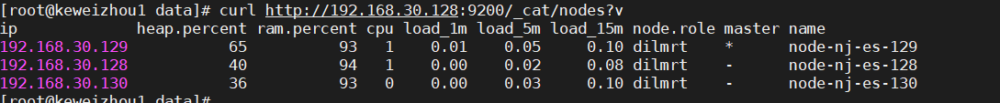

@[TOC]

# 前言

> 本文介绍了在Linux下es集群的安装部署，本文中的集群为三个节点的机器。

# 环境

- [elasticsearch-7.9.3-linux-x86_64.tar.gz](https://www.elastic.co/cn/downloads/past-releases/elasticsearch-7-9-3)
- jdk-8u321-linux-x64.tar.gz
- CentOS-7-x86_64-Minimal-1908.iso

# 集群安装部署

## 第一台机器

### 创建目录

```
//elasticsearch-7.9.3解压至此目录下
mkdir -p /usr/local/elasticsearch
//数据目录
mkdir -p /usr/local/elasticsearch/data
//日志目录
mkdir -p /usr/local/elasticsearch/log
```

### 配置elasticsearch.yml⽂件

```yaml
# 集群名称
cluster.name: keweizhou
# 节点名称
node.name: node-nj-es-128
# 节点角色
node.master: true
node.data: true
# 最大的节点数
node.max_local_storage_nodes: 3
# 绑定的ip地址
network.host: 192.168.30.128
# 对外的端口
http.port: 9200
# 节点间通信的端口
transport.tcp.port: 9800
#zen discovery config
discovery.seed_hosts: [ "192.168.30.128:9800","192.168.30.129:9800","192.168.30.130:9800" ]
discovery.zen.ping_timeout: 60s
discovery.zen.join_timeout: 60s
discovery.zen.master_election.ignore_non_master_pings: true
# 集群选举
cluster.initial_master_nodes: [ "node-nj-es-128","node-nj-es-129","node-nj-es-130" ]
# 数据目录和日志目录
path.data: /usr/local/elasticsearch/data
path.logs: /usr/local/elasticsearch/log

# 配置了之后可以在Kibana上看堆栈的监控数据
xpack.monitoring.enabled: true
xpack.monitoring.collection.enabled: true

#启用或禁用跨域资源共享
http.cors.enabled: true
###允许哪些来源
http.cors.allow-origin: "*"
```

### 修改jvm.options⽂件

```
cd /usr/local/elasticsearch/config
vim 
```

现在集群是2g

```yaml
-Xms1g
-Xmx1g
```

## 第二台机器

### 配置elasticsearch.yml⽂件

1. 将第一台机器的/usr/local/elasticsearch目录拷贝到第二台机器

```
scp -r elasticsearch/ root@192.168.30.129:/usr/local
```

2.修改配置文件 修改部分配置，其他和128机器保持一致

```yaml
node.name: node-nj-es-129
network.host: 192.168.30.129
```

## 第三台机器

1. 将第一台机器的/usr/local/elasticsearch目录拷贝到第二台机器

```
scp -r elasticsearch/ root@192.168.30.130:/usr/local
```

2.修改配置文件 修改部分配置，其他和128机器保持一致

```yaml
node.name: node-nj-es-130
network.host: 192.168.30.130
```

## 修改elasticsearch目录属主和数组

1. 新增es的用户和用户组

```
groupadd es
//useradd [user name] -g [group name] -p [password]
useradd es -g es -p xxx
```

把三台机器上的/usr/local/elasticsearch目录以及里面的内容的属主和属组都改成es用户

2. 修改

```
//chown -R [user name:group name]
chown -R es:es /usr/local/elasticsearch
```

## 切换到es用户，在3台机器上启动上面的es

启动前需切换到其他用户，需要建一个es的新用户和组。因为Elasticsearch 本身对此进行了限制，不能以 root 用户运行。

```
su es
./elasticsearch
```

### 可能遇到的问题

- 如果遇到提示用jdk11问题，则进行修改，使用es内置的jdk，修改elasticsearch-env(bin下)

```
# use elasticsearch jdk
ES_JAVA_HOME="/usr/local/elasticsearch/jdk"

# now set the path to java
if [ ! -z "$ES_JAVA_HOME" ]; then
  JAVA="$ES_JAVA_HOME/bin/java"
  JAVA_TYPE="ES_JAVA_HOME"
elif [ ! -z "$JAVA_HOME" ]; then
  JAVA="$JAVA_HOME/bin/java"
  JAVA_TYPE="JAVA_HOME"
...
```

- 如果遇到报错类似：max file descriptors [4096] for elasticsearch process is too low, increase to at least [65535]
  修改方法：

```
vim /etc/security/limits.conf
es  -  nofile  65535
```

- 如果遇到类似报错：max number of threads [3795] for user [es] is too low, increase to at least [4096]
  修改方法：

```
vim /etc/security/limits.conf
es  -  nproc  4096
```

参考：https://blog.csdn.net/qq_35787138/article/details/117756903

- 如果遇到类似报错：max virtual memory areas vm.max_map_count [65530] is too low, increase to at least [262144]
  修改方法：

```
vim /etc/sysctl.conf
vm.max_map_count=262144
```

如果没有生效，刷新一下：

```a
sysctl -p
```

参考：https://blog.csdn.net/weixin_39643007/article/details/108435139

- 如果遇到failure when sending a validation request to node 可能是该节点之前启动过，有历史数据存在，并且该数据与当前集群数据不一致导致，从日志可以看出两者的集群 uuid
  是不同的，因此需要清空旧数据，重启使 该节点连入集群，找到 elasticsearch.yml 中 path.data 对应的数据存储目录，清空该目录，然后重启。

# 集群启动验证

## 依次重启三个节点

```
./elasticsearch -d
```

## 验证

### 集群健康状态验证

```
curl http://192.168.30.128:9200/_cat/health?v
curl http://192.168.30.129:9200/_cat/health?v
curl http://192.168.30.130:9200/_cat/health?v
```

验证结果：


### 集群节点验证

```
curl http://192.168.30.128:9200/_cat/nodes?v
```

验证结果：


# es集群鉴权

## x-pack鉴权

待补充

# 遇到的问题

1. [linux安装ElasticSearch遇到的错误](https://blog.csdn.net/qq_39313596/article/details/107513482)
2. [Future versions of Elasticsearch will require Java 11； your Java version from](https://blog.csdn.net/qq2523208472/article/details/125043116)
3. [https://www.devopsschool.com/blog/elastic-search-error-max-file-descriptors-4096-for-elasticsearch-process-is-too-low-increase-to-at-least-65535/](https://www.devopsschool.com/blog/elastic-search-error-max-file-descriptors-4096-for-elasticsearch-process-is-too-low-increase-to-at-least-65535/)
4. [https://blog.csdn.net/qq_35787138/article/details/117756903](https://blog.csdn.net/qq_35787138/article/details/117756903)
5. [https://discuss.elastic.co/t/elasticsearch-start-failed-to-resolve-host-host1/136399](https://discuss.elastic.co/t/elasticsearch-start-failed-to-resolve-host-host1/136399)
6. [https://blog.csdn.net/c15158032319/article/details/125424331](https://blog.csdn.net/c15158032319/article/details/125424331)
7. [https://blog.csdn.net/weixin_30263277/article/details/99062372](https://blog.csdn.net/weixin_30263277/article/details/99062372)
8. [java.lang.IllegalStateException: failure when sending a validation request to node #88](https://github.com/lanlin/notes/issues/88)
9. [CentOS7安装elasticsearch-7.9.3集群](https://juejin.cn/post/7140847578949615630)