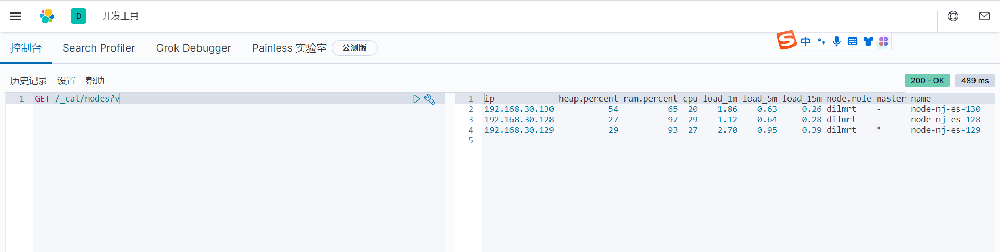

# 前言
> 本文主要介绍了Linux环境下Kibana的安装部署。

# 创建kibana⽤户
```
useradd kibana
passwd kibana
```

# 下载kibana安装包
版本为：7.9.3，下载地址：https://www.elastic.co/cn/downloads/past-releases#kibana
```
mkdir -p /usr/local/kibana
cd /usr/local/kibana
wget https://artifacts.elastic.co/downloads/kibana/kibana-7.9.3-linux-x86_64.tar.gz
```

# 解压
```
tar -zxvf kibana-7.9.3-linux-x86_64.tar.gz
```

# 配置kibana.yml
进入目录：/usr/local/kibana/kibana-7.9.3-linux-x86_64/config，清空kibana.ym文件,将elasticsearch.hosts修改为实际的es集群节点
```
echo '' > kibana.yml
vim kibana.yml
```

配置kibana.yml
```
#kibana的端口
server.port: 9000

# 绑定的地址
server.host: "0.0.0.0"

# es节点地址
elasticsearch.hosts: ["http://192.168.30.128:9200","http://192.168.30.129:9200","http://192.168.30.130:9200"]

# 显示的语言
i18n.locale: "zh-CN"
```

# 将/usr/local/kibana的属主和属组改成kibana用户
```
chown -R kibana:kibana /usr/local/kibana
```

# 启动kibana
```
nohup /usr/local/kibana/kibana-7.9.3-linux-x86_64/bin/kibana &
```

# 访问kibana
```
http://192.168.30.128:9000
```
## 查看集群节点状态


## 点击堆栈检测可以看到es集群中节点监控信息
