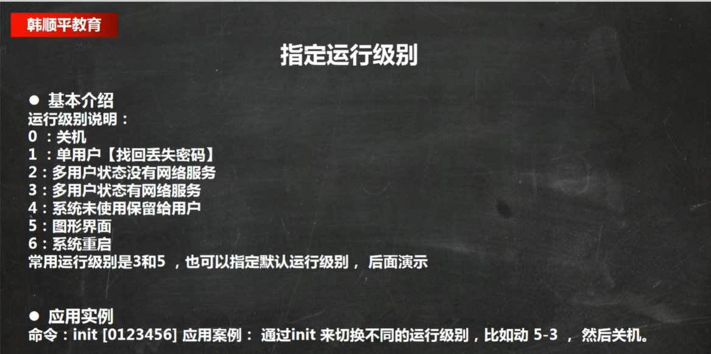

# Linux和Unix的关系


# Linux理论篇

## 网络连接的三种方式

### 桥接模式


桥接模式虽然解决了虚拟系统和外部通讯的问题，但是占据ip过多，容易造成ip冲突

### NAT模式


使用网络地址转换，虚拟系统就可以和外部系统通讯了，不会造成ip冲突

### 主机模式


一个独立的系统

## 虚拟机的管理

### 虚拟机克隆


### 虚拟机快照


## Linux的目录结构


**在Linux的世界里，一切皆文件**：在Linux中它把硬件也当做一个文件来看待，甚至你插入一个U盘，它也会自动识别，识别完之后也当做一个文件来看待

以下是一些重点的目录结构及功能：

- /bin (/usr/bin 、 /usr/local/bin)：Binary的缩写, 这个目录存放着最经常使用的命令
- /home ：存放普通用户的主目录，在Linux中每个用户都有一个自己的目录，一般该目录名是以用户的账号命名的。
- /root：该目录为系统管理员，也称作超级权限者的用户主目录。
- /sbin (/usr/sbin 、 /usr/local/sbin)：s就是Super User的意思，这里存放的是系统管理员使用的系统管理程序
- /lib： 系统开机所需要最基本的动态连接共享库，其作用类似于Windows里的DLL文件。几乎所有的应用程序都需要用到这些共享库。
- /lost+found 这个目录一般情况下是空的，当系统非法关机后，这里就存放了一些文件。
- /etc 所有的系统管理所需要的配置文件和子目录，比如安装mysql数据库my.conf
- /usr：这是一个非常重要的目录，用户的很多应用程序和文件都放在这个目录下，类似与windows下的program files目录。
- /boot：存放的是启动Linux时使用的一些核心文件，包括一些连接文件以及镜像文件
- /proc：不能动，这个目录是一个虚拟目录，它是系统内存的映射，访问这个目录来获取系统信息。同样的srv和sys目录也不能动
- /dev：类似于windows的设备管理器，把所有的硬件用文件的形式存储。
- /media：linux系统会自动识别一些设备，例如U盘、光驱等等，当识别后，linux会把识别的设备挂载到这个目录下。
- /mnt：系统提供该目录是为了让用户临时挂载别的文件系统的，我们可以将外部的存储挂载在/mnt/上，然后进入该目录就可以查看里的内容了。 d:/myshare
- /opt： 这是主机给安装软件所存放的目录，如果按照JDK可放到改目录下默认为空。
- /usr/local：这是另一个给主机额外安装软件所安装的目录。一般是通过编译源码方式安装的程序。
- /var：这个目录中存放着在不断扩充着的东西，习惯将经常被修改的目录放在这个目录下。包括各种日志文件。一般日志都放在这个目录下面

cd / :斜杠代表根目录

## Linux的文本编辑器


## Linux关机&重启命令


尽量不要使用root账号登录，因为root的权限比较大，避免误操作


## Linux的用户管理

Linux系统是一个多用户多任务的操作系统，任何一个要使用系统资源的用户，都必须首先向系统管理员申请一个账号，然后以这个账号的身份进入系统

### 基本命令和概念

**1.添加用户**

- 基本语法： useradd 用户名（细节说明：1.当创建用户成功后，会自动创建和用户同名的家目录 2.也可以通过useradd -d 指定目录 新的用户名，给新创建的用户 指定家目录，默认的家目录在/home目录下）

**2. 更改密码**

给用户指定或修改密码

```
passwd 用户名
```

**3. 删除用户**

```shell
# 删除用户,但是保留家目录
userdel 用户名
# 删除用户以及用户主目录（使用这个命令要注意，把用户资料也删除了）
userdel -r xlh
```

**4.查询用户**

```shell
id 用户名
#当用户不存在时候，返回无此用户
```

示例：

```text
[root@keweizhou1 home]# id root
uid=0(root) gid=0(root) groups=0(root)
```

**5.切换用户**

```shell
su 用户名
#默认输入su 切换到管理员目录
```

注：1.从权限高的用户切换到权限低的用户，不需要输入密码，反之需要 2.当需要返回到原来的用户时，使用exit/logout指令

**6.用户组**

用户组类似于角色的概念，系统可以对共性/权限的多个用户进行统一的管理

如果没有加组的话，它会默认生成一个和用户名一样的组，把这个用户放到这个组里面去

```shell
# 新增组
groupadd 组名

# 删除组
groupdel 组名

# 增加用户时直接加上组
useradd -g 用户组 用户名

# 修改用户组
usermod -g 用户组 用户名

# 查看设置情况
id 用户名

# 例如：id world
uid=1006(world) gid=1006(hello) groups=1006(hello)
```

**7.用户和组相关的文件**

/etc/passwd文件（用户的配置文件记录用户的各种信息）、/etc/shadow文件（口令的配置文件）、/etc/group文件（组的配置文件，记录Linux包含的组信息）


### 总结

- 当用户创建成功之后，会自动地创建和用户命名的家目录
- 添加用户（给用户添加密码）、切换用户
- 删除用户
- 用户组（类似于角色，有共性的用户可以进行统一的管理）

## 指令运行级别



```shell
#查看默认的运行级别
systemctl get-default
```

## 帮助指令

- man 获得帮助信息，示例：man ls
- help指令，基本语法：help 命令
- 百度搜索

linux下隐藏文件是以.开头的

## 文件目录指令

### 操作类常用指令

| **指令**    | **功能**                   | **备注**                                                            |
|-----------|--------------------------|-------------------------------------------------------------------|
| **pwd**   | 显示当前工作目录的绝对路径            |                                                                   |
| **ls**    | ls [选项] [目录或是文件]         | 常用选项 -a显示目录所有的文件和目录 包括隐藏的，-l 以列表的方式显示信息，查看显示当前目录下的所有内容            |
| **cd**    | 切换到指定目录                  | cd ~ 回到自己的家目录，cd… 回到当前目录的上一级目录                                    |
| **mkdir** | 用于创建目录                    |  -p 创建多级目录                                                        |
| **rmdir** | 指令删除空目录                  | 如果删除的不是空目录 需要用rm -rf要删除的目录                                      |
| **touch** | 创建空文件                     |                                                                   |
| **cp**    | 拷贝文件到指定目录 cp source dest | -r 递归复制整个文件                                                       |
| **rm**    | 移除文件或者目录                 | -r 递归删除整个文件夹， -f 强制删除不提示                                        |
| **mv**    | 移动文件或重命名                 |  mv oldName newName (重命名)，mv temp/movefile /targetFolder (移动文件) |
                               |
### 查看类常用指令

- **cat**:查看文件内容

```text
cat [选项] 要查看的文件，-n 显示行号， cat只能浏览文件，并不能修改文件，为了浏览方便，一般会用上管道命名 |more
```

- **more**：要查看的文件

```text
more指令是一个基于vi编辑器的文本过滤器，他以全屏的方式显示文本文件的内容，more指令内置了若干快捷键
```


- **less**

```text
less指令用于来分屏查看文件内容，他的功能与more类似，但是比more更加强大，支持各种显示终端。less指令在显示文件内容时，并不是一次将整个文件加载后才显示的，而是根据要加载的内容，对显示大型文件具有高效率
```


- **echo**:将输入内容到控制台

```text
echo [选项] [输出内容]

echo $USERNAME 输出当前主机名称

echo “hello,world” 将helllo world 输入到控制台
```

- **head**: head用于显示文件开头部分内容，默认情况下head希纳是文件前10行的内容

```text
基本语法： head 文件

head -n -5 文件 显示前五行的内容 5可以时任意数
```

- **tail**: tail用于输出文件中尾部的内容，默认情况下tail指令显示文件的前10行内容

```text
tail 文件 （查看文件最后10行的内容）

tail -n -5 文件 （查看文件最后5行的内容，5可以是任意数）

tail -f 文件 （实时更新该文档所有的更新）
```

- **>指令和>>指令**： >输出重定向 ，>>追加

```text
echo ‘hello’ > /opt/test.txt （将hello输入到opt文件夹下的test.txt中 之前内容覆盖）

cat /etc/profile > /home/myprofile （将etc/profile 重定向到home目录下的myprofile 没有会自动创建）

cal > /opt/test （将日历信息重定向输出到opt下的test文件）覆盖

cal >> /opt/test （将日历信息追加到opt目录下的test文件）追加
```
