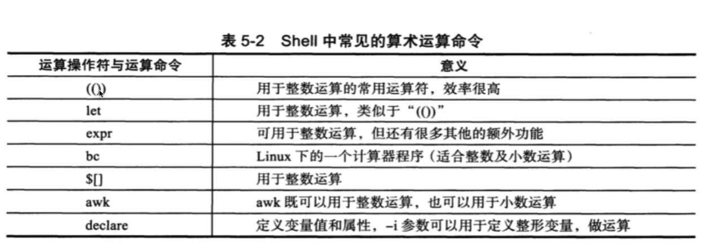

# 父子shell

## 父子shell执行

1. source和点，执行脚本，只在当前shell环境中执行生效
2. 指定bash sh 解释器运行脚本，是开启subshell，开启子shell运行脚本命令
3. ./script，都会指定shebang，通过解释器运行，也是开启subshell运行命令

## 查看父子shell命令

1. pstree看到如下结果，就是父shell环境

```text
pstree

|-sshd-sshd-bash-pstree
```

2. 利用ps进程管理命令查看

```text
ps -ef 
-f 显示UID，PID，PPID
-e 列出所有进程的信息，如同-A选项option

ps -ef --forest

例如：
root        965      1  0 22:15 ?        00:00:00 /usr/sbin/sshd -D
root       1785    965  0 22:18 ?        00:00:00  \_ sshd: root@pts/0
root       1789   1785  0 22:18 pts/0    00:00:00  |   \_ -bash
root       1986   1789  0 23:38 pts/0    00:00:00  |       \_ ps -ef --forest

通过它的PID，PPID也可以看出来它们的层级关系
```

## 多个子shell

在当前shell中又运行了sh，就会开启一个子shell，利用exit退出子shell，只要输入exit，就能够退出子shell环境了。

多个子shell图示：

```text
root        965      1  0 22:15 ?        00:00:00 /usr/sbin/sshd -D
root       1785    965  0 22:18 ?        00:00:00  \_ sshd: root@pts/0
root       1789   1785  0 22:18 pts/0    00:00:00  |   \_ -bash
root       1988   1789  0 23:45 pts/0    00:00:00  |       \_ bash
root       1999   1988  0 23:45 pts/0    00:00:00  |           \_ bash
root       2010   1999  0 23:45 pts/0    00:00:00  |               \_ sh
root       2011   2010  0 23:45 pts/0    00:00:00  |                   \_ sh
root       2012   2011  0 23:45 pts/0    00:00:00  |                       \_ sh
root       2013   2012  0 23:45 pts/0    00:00:00  |                           \_ ps -ef --forest
```

## 创建进程列表

执行一些列命令必须用“;”隔开，如

```shell
ls;cd;pwd;echo "hello"
```

shell的进程列表的理念，需要使用()小括号，如下执行方式，就称之为，进程列表

```shell
(cd ~;pwd;ls ;cd /tmp/;pwd ;ls)
```

检测是否在子shell环境中：

```text
linux默认的有关shell的变量

#该变量的值特点，如果是0，就是当前shell环境中执行的，否则就是开辟子shell去运行的
BASH_SUBSHELL
```

检测是否开启子shell运行命令

```shell
sh-4.2# cd ~;pwd;ls ;cd /tmp/;pwd ;ls;echo ${BASH_SUBSHELL}
/root
anaconda-ks.cfg
/tmp
systemd-private-7b47f72631864e9ebc1bbf3d64cf90a5-chronyd.service-7ANwBd  systemd-private-e1149a55578f421a8582fc4c31b0cc77-chronyd.service-80UWg7
systemd-private-c12bcdca0f774c248b9c66b301dad2c2-chronyd.service-1hPhV4
0
```

明确开启子shell运行的命令

```shell
sh-4.2# (sh-4.2# cd ~;pwd;ls ;cd /tmp/;pwd ;ls;echo ${BASH_SUBSHELL})
sh: sh-4.2#: command not found
/tmp
systemd-private-7b47f72631864e9ebc1bbf3d64cf90a5-chronyd.service-7ANwBd  systemd-private-e1149a55578f421a8582fc4c31b0cc77-chronyd.service-80UWg7
systemd-private-c12bcdca0f774c248b9c66b301dad2c2-chronyd.service-1hPhV4
/tmp
systemd-private-7b47f72631864e9ebc1bbf3d64cf90a5-chronyd.service-7ANwBd  systemd-private-e1149a55578f421a8582fc4c31b0cc77-chronyd.service-80UWg7
systemd-private-c12bcdca0f774c248b9c66b301dad2c2-chronyd.service-1hPhV4
1
```

## 子shell嵌套运行

刚才是一个小括号，开启一个子shell运行命令，还可以嵌套多个

```shell
[root@keweizhou1 ~]# (pwd;(echo ${BASH_SUBSHELL}));
/root
2
[root@keweizhou1 ~]#
```

在shell脚本开发中，经常会用子shell进行多线程的处理，提高程序并发执行效率。

# 内置命令、外置命令

## 概念

什么是内置命令，什么是外置命令？

```text
内置命令：在系统启动时就加载入内存，常驻内存，执行效率高，但是占资源，比如cd命令
外置命令：系统需要从硬盘中读取程序文件，再读入内存加载
```

## 内置命令

内置命令不会产生子进程去执行，内置命令和shell是一体的，是shell的一部分，不需要单独去读取某个文件，系统启动后就执行在内存中了

通过type命令验证即可：

```shell
[root@keweizhou1 ~]# type cd
cd is a shell builtin
[root@keweizhou1 ~]# type pwd
pwd is a shell builtin
[root@keweizhou1 ~]#
```

通过命令"compgen -b"列出来的命令都是linux的内置命令

## 外置命令

外置命令，也称之为自己单独下载的文件系统命令，处于bash shell之外的程序

```shell
/bin
/usr/bin
/sbin
/usr/sbin

[root@keweizhou1 ~]# which cd
/usr/bin/cd
[root@keweizhou1 ~]#
```

比如cd、ps命令，注意：

```text
通过linux的type命令，验证是否是内置、外置命令
```

外置命令的特点是：一定会开启子进程执行

```shell
root       2044    965  0 Aug26 ?        00:00:00  \_ sshd: root@pts/0
root       2048   2044  0 Aug26 pts/0    00:00:00  |   \_ -bash
root       2746   2048  0 04:40 pts/0    00:00:00  |       \_ ps -ef --forest
```

# Shell脚本开发

执行脚本的方式

```text
source test.sh

.test.sh

bash test.sh

./test.sh
```

对于linux特殊符号的处理

```text
${vars} 取出变量结果
$()     在括号中执行命令，且拿到命令的执行结果
``      在括号中执行命令，且拿到命令的执行结果
()      开启子shell执行命令结果
```

# Shell脚本数值运算

- shell脚本常见的算术运算符号


- shell脚本中常见的算术命令



- 双小括号"(())"的操作方法

)的操作方法.png)

```shell
[root@keweizhou1 shell]# echo $(3+2)
-bash: 3+2: command not found

[root@keweizhou1 shell]# echo $((3+2))
5
[root@keweizhou1 shell]# echo $((10/3))
3
[root@keweizhou1 shell]# echo $((10**3))
1000
[root@keweizhou1 shell]# echo $((10%3))
1
[root@keweizhou1 shell]#
```

有关逻辑运算，真假的区别，真为1，假为0

**注意：**
shell的一些基础命令，只支持整数的运算，小数的计算需要如bc这样的命令才支持

变量的运算，支持在括号里面支持变量的定义，赋值操作：

```shell
[root@keweizhou1 shell]# num=5
[root@keweizhou1 shell]# echo ${num}
5
[root@keweizhou1 shell]# ((num=num*5))
[root@keweizhou1 shell]# echo $num
25
[root@keweizhou1 shell]# echo ((num=num*5))
-bash: syntax error near unexpected token `('
[root@keweizhou1 shell]# echo $((num=num*5))
125
[root@keweizhou1 shell]#
```

# Shell特殊符号运算

- ++和--操作

这两个操作同c语言类似

需求开发：开发一个计算器，必须是数字，否则退出，只支持+ - * /四则运算

```shell
#! /bin/bash

print_usage(){
        printf "Please input an integer！！！\n"
        exit 1
}

#接收用户输入的命令，-p参数后面写给用户看到的提示信息
#read -p "提示信息" 接受用户输入的变量
read -p "Please input your number:" firstNumber


#进行对用户输入判断if语句，用来限制用户必须输入纯数字
#注意：中括号里面前后必须有一个空格，是固定语法
#-n参数是if的语句，对字符串判断，如果字符串为空，条件就不成立，如果字符串不为空，条件成立
#sed作用就是把上述字符串“qwe123”进行替换，把所有的数字都替换为空，那么剩下就是其他非数字的内容了
if [ -n "`echo $firstNumber|sed 's/[0-9]//g'`" ]
  then
      print_usage
fi


# 上面的代码都是对用户输入进行判断

# 希望用户输入3+5

# 此时对运算符进行输入
read -p "Please input your operator:" operator

#对运算符进行判断
#限制在+ - * /四个符号

if [ "${operator}" != "+" ]&&[ "${operator}" != "-" ]&&[ "${operator}" != "*" ]&&[ "${operator}" != "/" ]
  then
    echo "只允许输入 +|-|*|/"
    exit 2
fi

#对第二个变量进行处理
read -p "Please input second number:" secondnum
if [ -n "`echo $firstNumber|sed 's/[0-9]//g'`" ]
  then
      print_usage
fi

#最后进行数值计算，利用双小括号计算
echo "${firstNumber}${operator}${secondnum}结果是：$((${firstNumber}${operator}${secondnum}))"
```

