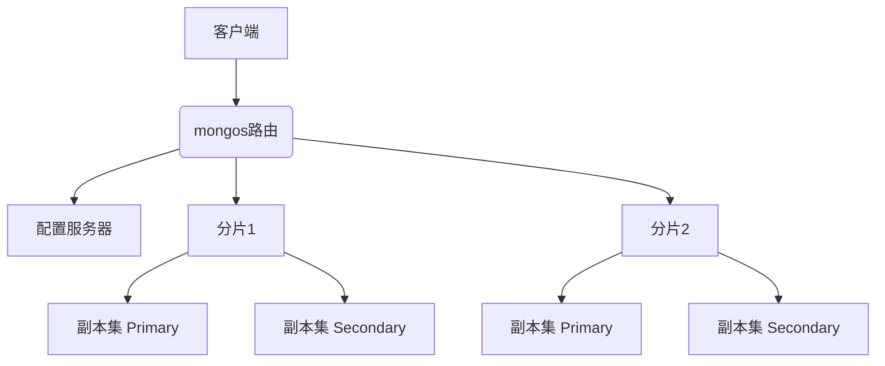

[toc]

## MongoDB技术文档及与MySQL对比分析

### 一、MongoDB核心概述
MongoDB是一种**开源文档型NoSQL数据库**，由C++语言编写，采用分布式文件存储架构。其核心定位是为Web应用提供可扩展的高性能数据存储解决方案。作为NoSQL领域的代表，MongoDB在DB-Engines排名中持续领先，主要特点包括：

- **文档模型**：数据以BSON（Binary JSON）格式存储，支持嵌套文档和数组结构，可动态适应数据结构变化。
- **动态模式**：无需预定义表结构，同一集合中的文档可包含不同字段。
- **水平扩展**：通过分片技术（Sharding）实现PB级数据分布式存储。
- **高性能**：WiredTiger存储引擎（默认）支持文档级并发控制和压缩存储，性能较早期引擎提升7-10倍。

### 二、核心概念解析
| 术语 | 说明 | SQL对应概念 |
|------|------|-------------|
| 文档(Document) | 数据基本单元（BSON格式键值对） | 行(Row) |
| 集合(Collection) | 文档的容器，无需固定结构 | 表(Table) |
| 数据库(Database) | 集合的物理容器 | 数据库(Database) |
| `_id` | 文档唯一标识符（自动生成） | 主键(Primary Key) |
| 嵌入文档 | 嵌套子文档替代关联表 | JOIN操作 |

示例文档结构：
```json
{
  "_id": ObjectId("5f9d1a9d8c6d4e3d7c8b438a"),
  "name": "李四",
  "age": 30,
  "address": {
    "city": "北京",
    "postal": "100000"
  },
  "hobbies": ["摄影", "登山"]
}
```

### 三、架构设计
#### 1. 单机部署架构
```
+----------------+
| 客户端应用     |
+----------------+
       ↓
+----------------+
| MongoDB实例    |
| - 存储引擎     |
|   (WiredTiger) |
| - 查询处理器   |
+----------------+
       ↓
+----------------+
| 文件系统       |
| (BSON数据文件) |
+----------------+
```

#### 2. 分布式集群架构


关键组件：
- **分片(Shard)**：数据水平拆分单元（每个分片为副本集）
- **mongos**：查询路由分发器
- **配置服务器**：存储集群元数据
- **副本集**：1主多从结构，自动故障转移（基于Raft协议）

### 四、功能特性
1. **灵活数据模型**  
   支持动态增删字段，嵌套文档可替代多表关联，适应快速迭代的开发场景。

2. **索引机制**  
   支持多级索引（包括地理空间、文本、TTL生存时间索引），例如：
```javascript
// 创建地理位置索引
db.places.createIndex({ location: "2dsphere" })

// 创建TTL索引（自动删除7天前数据）
db.logs.createIndex({ createdAt: 1 }, { expireAfterSeconds: 604800 })
```

3. **聚合框架**  
   提供管道式数据处理（超过150个操作符）：
```javascript
db.orders.aggregate([
  { $match: { status: "completed" } },
  { $group: { 
      _id: "$product", 
      total: { $sum: "$amount" }
  }},
  { $sort: { total: -1 } }
])
```

4. **高可用性**  
   复制集实现自动故障转移，分片集群支持在线扩容。

### 五、MongoDB vs MySQL 核心区别
| 维度 | MongoDB | MySQL |
|------|---------|-------|
| **数据模型** | 文档型(BSON) | 关系型(表格) |
| **Schema约束** | 动态模式 | 需预定义表结构 |
| **事务支持** | 4.0+支持多文档ACID事务 | 全面ACID事务 |
| **扩展方式** | 原生水平扩展(分片) | 垂直扩展/分库分表 |
| **查询语言** | JSON风格查询语法 | SQL标准 |
| **关联查询** | $lookup操作符（有限支持） | JOIN深度支持 |
| **适用场景** | 大数据量、非结构化数据 | 强事务一致性系统 |

#### 典型场景对比
1. **社交应用**  
   MongoDB优势：存储用户动态（可变数据结构）、朋友圈地理空间查询
```python
# 查询5公里内的朋友
db.users.find({
  location: {
    $near: {
      $geometry: { type: "Point", coordinates: [116.4, 39.9] },
      $maxDistance: 5000
    }
  }
})
```

2. **金融交易系统**  
   MySQL优势：跨表事务保证数据一致性
```sql
START TRANSACTION;
UPDATE accounts SET balance = balance - 100 WHERE id = 1;
UPDATE accounts SET balance = balance + 100 WHERE id = 2;
COMMIT;
```

3. **物联网(物联网)**  
   MongoDB优势：高效存储设备传感器数据（时间序列数据）
```javascript
db.sensors.insertMany([
  { device: "A001", timestamp: ISODate(), temp: 23.5 },
  { device: "B002", timestamp: ISODate(), pressure: 1013 }
])
```

### 六、总结
MongoDB的**文档模型**和**分布式架构**使其在**处理非结构化数据、快速迭代项目和大规模扩展**场景中具有显著优势。而MySQL凭借**成熟的SQL生态**和**强事务保证**，仍是**金融、ERP等需要复杂事务系统**的首选。

> **技术选型建议**：
> - 选择MongoDB当：数据结构多变、需水平扩展、读写并发高（如内容管理、实时分析）
> - 选择MySQL当：需复杂事务、强一致性保证、成熟SQL生态（如支付系统、库存管理）

两种数据库并非互斥，现代应用常组合使用（如用MongoDB存储用户行为数据，MySQL存储订单交易数据），充分发挥各自优势。随着MongoDB持续增强事务能力，MySQL支持JSON字段类型，两者的能力边界正在逐步融合。