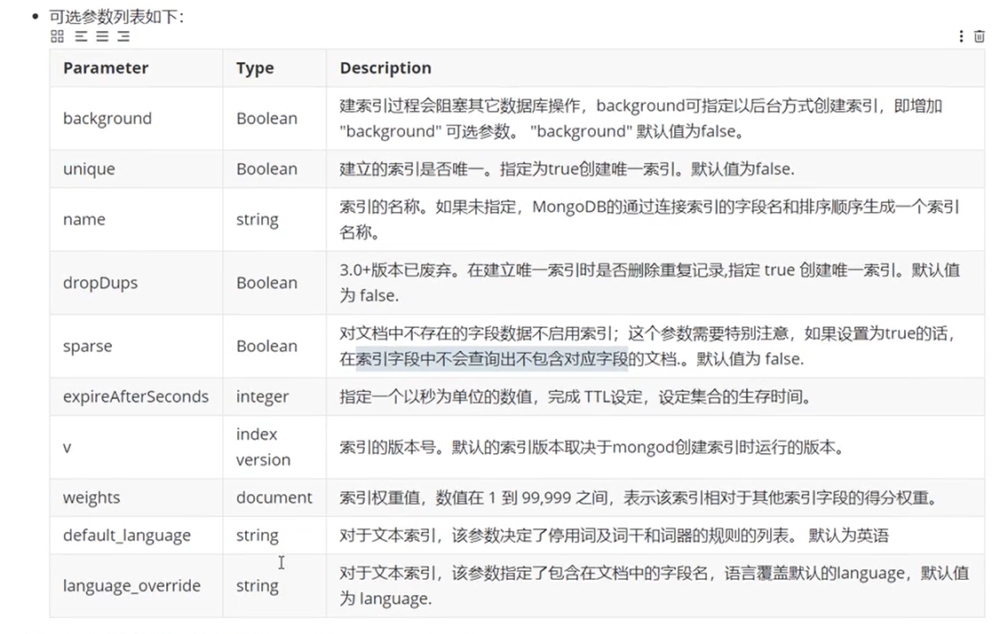
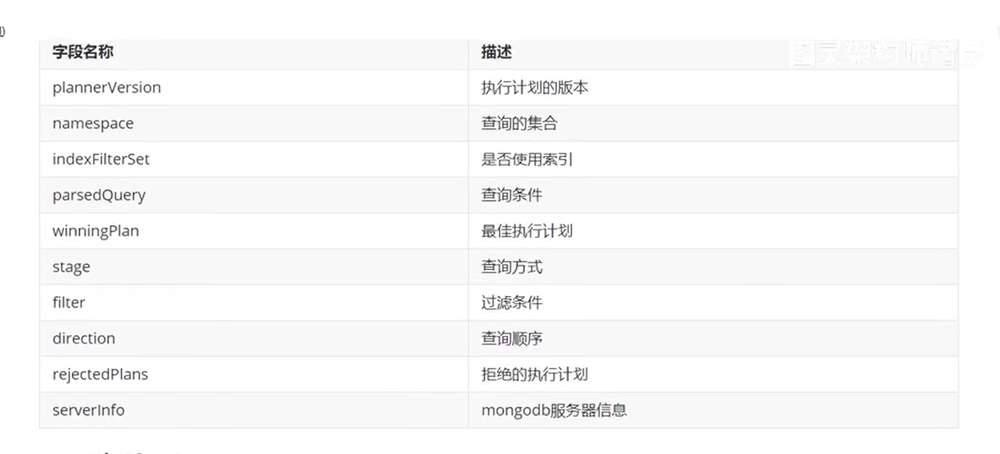
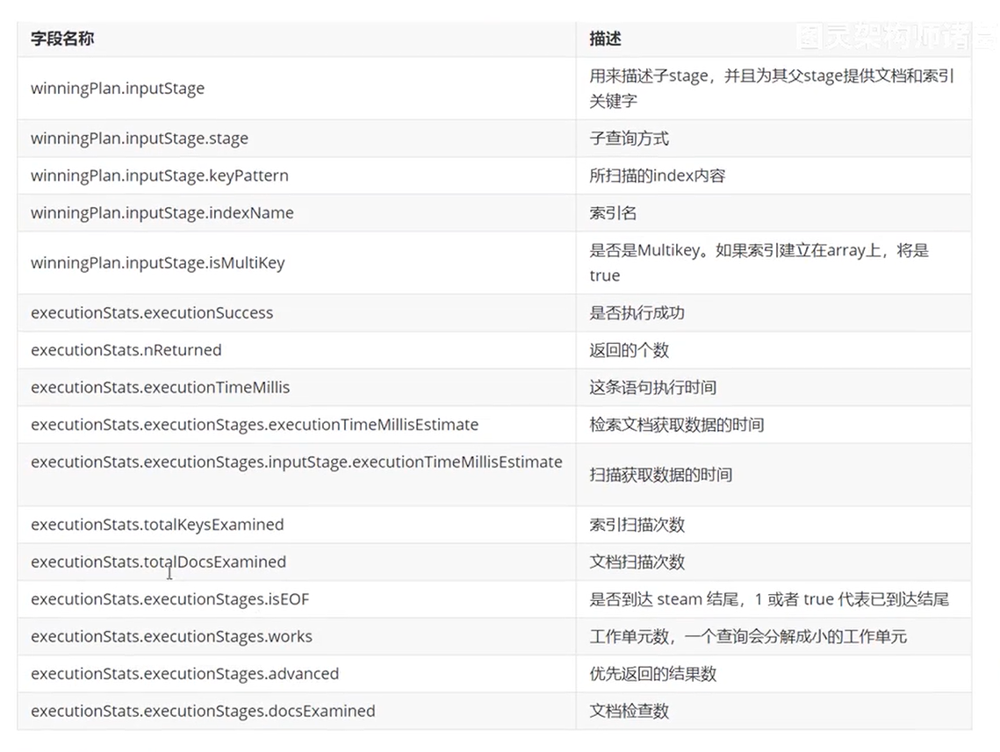
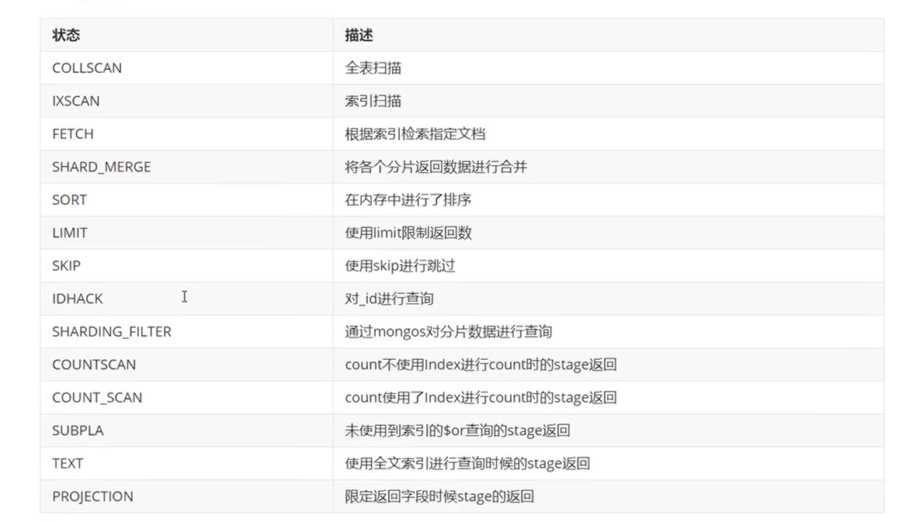

> 本文主要介绍了mongoDB的索引管理
# 前言
索引支持在MongoDB中高效地执行查询。如果没有索引，MongoDB必须执行全集合扫描，即扫描集合中的每个文档，以选择与查询语句匹配的文档。
这种扫描全集合的查询效率是非常低的，特别在处理大量的数据时，查询可以要花费几十秒甚至几分钟，这对网站的性能是非常致命的。

# 索引的介绍
## 索引介绍
如果查询存在适当的索引，MongoDB可以使用该索引限制必须检查的文档数。索引是特殊的数据结构，它以易于遍历的形式存储集合数据集的一小部分。
索引存储特定字段或一组字段的值，按字段值排序。索引项的排序支持有效的相等匹配和基于范围的查询操作。此外，MongoDB还可以使用索引中的排序
返回排序结果。MongoDB索引使用B树数据结构(MySQL用的是B+Tree，其实准确的来说MongoDB使用的就是B+Tree)。

## 索引的分类
不同的分类维度，可以分成不同的组
- 按照索引包含的字段数量，可以分为单键索引和组合索引（复合索引）
- 按照索引的字段类型，可以分为主键索引和非主键索引
- 按照索引节点与物理节点的对应方式来分，可以分为聚簇索引和非聚簇索引，其中聚簇索引指的是索引节点上直接包含了数据记录，而后者仅仅是包含
一个指向数据记录的指针。
- 按照索引的特性不同，又可以分为唯一索引、稀疏索引、文本索引、地理空间索引等。


# 索引的类型
## 单字段索引
MongoDB支持在文档的单个字段上创建用户定义的升序/降序索引，称为单字段索引（Single Field Index）。对于单个字段索引和排序操作，索引键
的排序顺序（即升序或降序）并不重要，因为MongoDB可以在任何方向上遍历索引。
下图说明了使用索引选择和排序匹配文档的查询：


它的排列顺序呢就是按照18，30，45等顺序排列，会存储这样的索引数据结构。比如我们去查询score=30的时候先去查索引数据，找到之后再去collection
中找它真实的文档。单字段索引创建，无论是升序或者降序，那么它的效率没多大区别。

## 复合索引
MongoDB还支持多个字段的索引，即复合索引（Compound index）。复合索引中列出的字段的顺序具有重要的意义。
例如如果复合索引由{userId:1,score:-1}组成，则索引首先通过ask的顺序按照userId正序排序，然后在每个
userId内，再按照core倒序排序(比如图中的ca2三个一样，然后在内部再做一个userId的降序排序)。

## 多键索引
在数组的属性上建立索引，针对这个数组的任意值的查询都会定位到这个文档，既多个索引入口或者键值引用同一个文档

创建集合：
```
db.inventory.insertMany([
{ _id: 5, type: "food", item: "aaa", ratings: [ 5, 8, 9 ] }
{ _id: 6, type: "food", item: "bbb", ratings: [ 5, 9 ] }
{ _id: 7, type: "food", item: "ccc", ratings: [ 9, 5, 8 ] }
{ _id: 8, type: "food", item: "ddd", ratings: [ 9, 5 ] }
{ _id: 9, type: "food", item: "eee", ratings: [ 5, 9, 5 ] }
])
```
创建多键索引：
```javascript
db.inventory.createIndex( { ratings: 1 } )
```
多键索引很容易与复合索引产生混淆，复合索引是多个字段的组合，而多键索引仅仅是在一个字段上出现了多键（multi key）。
而实质上，多键索引也可以出现在复合字段上。
```javascript
//创建复合多键索引
db.inventory.createIndex( { item:1,ratings: 1} )
```
注意：MongoDB并不支持一个复合索引中同时出现多个数组字段
嵌入文档的索引数组：
```
db.inventory.insertMany([
{
  _id: 1,
  item: "abc",
  stock: [
    { size: "S", color: "red", quantity: 25 },
    { size: "S", color: "blue", quantity: 10 },
    { size: "M", color: "blue", quantity: 50 }
  ]
},
{
  _id: 2,
  item: "def",
  stock: [
    { size: "S", color: "blue", quantity: 20 },
    { size: "M", color: "blue", quantity: 5 },
    { size: "M", color: "black", quantity: 10 },
    { size: "L", color: "red", quantity: 2 }
  ]
},
{
  _id: 3,
  item: "ijk",
  stock: [
    { size: "M", color: "blue", quantity: 15 },
    { size: "L", color: "blue", quantity: 100 },
    { size: "L", color: "red", quantity: 25 }
  ]
}
])
```
创建索引：
```javascript
db.inventory.createIndex( { "stock.size": 1, "stock.quantity": 1 } )
```
查询：
```javascript
db.inventory.find( { "stock.size": "L", "stock.quantity": {$gt:20} } )
```
看看是否用到了索引：
```javascript
db.inventory.find( { "stock.size": "L", "stock.quantity": {$gt:20} } ).explain()
```

## Hash索引（Hashed Indexes）
和传统的B-Tree索引不同，哈希索引使用了hash函数来创建索引。在索引字段上进行精确匹配，但不支持查询范围，不
支持多键hash,Hash索引上的入口是均匀分布的，在分片集合中非常有用；
例如：
```javascript
db.users.createIndex({username:'hashed'})
```

## 全文索引
MongoDB支持全文索引(Text Indexes)功能，可以通过建立文本索引来实现简易的分词检索。
创建索引：
```javascript
db.reviews.createIndex({comments:"text"})
```

## TTL索引
有时候在我们的系统里，并非所有的数据都需要永久存储。例如一些系统事件、用户消息等，这些数据随着时间的推移，
它的重要长度逐渐降低。更重要的是，存储这些大量的历史数据需要花费较高的成本，因此项目对这些过期不再使用的
数据进行老化处理。
通常的做法如下：
- 为每个数据记录一个时间戳，开启一个定时器，按时间戳定时删除过期的数据
- 数据安日期进行分表，同一天的数据归档到同一张表，同样使用定时器删除对应的表

对应这些数据，MongoDB提供了一种更加便捷的做法：TTL(Time To Live)索引。TTL索引需要申明在一个日期类型的字段
中，TTL索引是一个特殊的单字段索引，MongoDB可以使用它在一定时间或者特定时钟时间后自动从集合中删除文档。

创建TTL索引，TTL值为60s，
```javascript
db.eventlog.createIndex( { "lastModifiedDate": 1 }, { expireAfterSeconds: 60 } )
```

对集合创建TTL索引之后，MongoDB会使用周期性运行的后台线程中对该集合进行检查及数据清理工作，除了数据老化功能
TTL索引具有普通索引的功能，同样可以加速数据的查询。

TTL索引不保证过期的数据会在过期后立即被删除。文档过期和MongoDB从数据库中删除文档的时间之间可能存在延迟。删除
过期文档的后台任务每60秒运行一次。因此，在文档到期和后台任务运行之间的时间段内，文档可能会保留在集合中。

例如：
准备数据：
```javascript
db.log_events.insertOne( {
   "createdAt": new Date(),
   "logEvent": 2,
   "logMessage": "Success!"
} )
```

创建TTL索引：
```javascript
db.log_events.createIndex( { "createdAt": 1 }, { expireAfterSeconds: 10 } )
```

TTL索引创建之后，仍然可以对过期的时间进行修改。这需要使用collMod命令对索引的定义进行变更
可变的过期时间：
```javascript
db.runCommand({
  "collMod": "log_events",
  "index": {
    "keyPattern": { "lastModifiedDate": 1 },
    "expireAfterSeconds": 100
  }
})
```

## 其他索引
MongoDB除了默认的id索引，单字段索引，复合索引，还有其他的一些索引。如地理空间索引(Geospatial Index)、
文本索引（Text Indexes）、哈希索引（Hashed Indexes）。

- 地理空间索引(Geospatial Index)
为了支持对地理空间坐标的有效查询，MongoDB提供了两种特殊的索引：返回结果时使用平面几何的二维索引和返回
结果时使用球面几何的二维球面索引。

- 文本索引（Text Indexes）
MongoDB提供了一种文本索引类型，支持在集合中索引字符串的内容。这些文本索引不存储特定语言的停止词（例如
“the”、“a”、“or”），而将集合中的词作为词干，只存储词根。文本索引有点类似于Lucene，性能不高，如果
我们需要做一些文本索引去搜索或者查询的话，那么还是建议使用Lucene或者es这些成熟的搜索引擎。

- 哈希索引（Hashed Indexes）
为了支持基于hash的分片，MongoDB提供了hash索引类型，它对字段值的hash进行索引。这些索引在其范围内的值
分布更加随机，但值支持相等匹配，不支持基于范围的查询。


#索引的基本操作
## 索引的查看
返回是一个数组，这个主键是默认会创建的一个索引，而且这个索引是唯一索引，和咱们的MySQL是很像。
v:表示索引引擎的版本号（2表示咱们MongoDB索引的引擎是第二个版本，这个不用管MongoDB底层的东西，后面还会
更新）
key：表示你在哪个字段上加的索引，1表示你这个索引创建的是升序的方式
name：索引的名称，默认是xx_1(或者xx_-1)
ns:namespace,是哪个数据库下面的哪个个集合

```javascript
//查看索引键
db.books.getIndexKeys()
```

查看索引的占用空间
```javascript
db.collection.totalIndexSize([is_detail])
```
is_detail:可选参数，传入0或者false外的任意数据，都会显示该集合每个索引的大小以及总大小。如果传入0或者false
则只显示该集合中所有索引的总大小。默认为false。


## 创建索引
```javascript
db.collection.createIndex(keys,options)
```
参数的可以选项options：

3.0.0版本之前创建索引方法为：db.collection.ensureIndex()
```javascript
//创建索引后台执行
db.collection.createIndex({open:1,close:1},{background:true})
//创建唯一索引
db.collection.createIndex({title:1},{unique:true})
```


- 单字段索引创建


- 复合索引创建


## 删除索引
不用的时候需要把索引移除，因为索引也是一个小的集合，会占用一定的存储空间，如果索引中建了许多不必要的索引,
也会拖累你的插入效率的，因为在插入的时候也需要维护索引数据。
语法：
```javascript
db.collection.dropIndex(index)
```
支持通过名称删除，或者之前建立的条件删除。

- 删除指定的索引


- 删除所有的索引


# 索引的使用
## 索引的执行计划
通常使用执行计划来分析查询性能，如查询耗时的时间，是否基于索引查询等。那么通常我们想知道建立的索引是否
有效，效果如何，都需要通过执行计划来查看。
通常我们最关心的问题：
- 查询是否使用了索引？
- 索引是否减少了扫描记录的数量？
- 是否存在低效的内存排序？

MongoDB提供了explain命令，它可以帮助我们指定查询模型（querymodel）的执行计划，根据实际情况进行调整，
然后提高查询效率。比如你扫描了大量的集合，没有用到索引等，这些都是可以去优化的。
explain方法的形式如下：
```
db.collection.find().explain(<berbose>)
```
berbose可选模式有3种。
- queryPlanner



- executionStats
executionStats模式的返回信息中包括了queryPlanner模式的所有字段，并且包含了最佳执行计划的执行情况。


- allPlansExecution
allPlansExecution返回的信息包含executionStats模式的内容，且包含allPlansExecution:[]块


语法：
```javascript
db.collection.find(query,options).explain(options)
```
执行计划中的stage类型

- COLLSCAN : 集合扫描，说明没有用到索引走的是全表扫描
- FETCH : 抓取，根据索引去检索

执行计划的返回结果中尽量不要出现以下的stage：
- COLLSCAN(全表扫描)，数据小无所谓，数据大了可能就会导致慢查询了
- SORT(使用sort但是无index)：尽量使用索引的排序，特别是复合索引
- 不合理的SKIP
- SUBPLA(未用到index的$or)
- COUNTSCAN(不使用index进行count)


## 涵盖的查询（Covered Queries）
当查询条件和查询的投影仅包含索引的字段时，MongoDB直接从索引返回结果，而不扫描任何文档或将文档带入到内存。
这些覆盖的查询效率是非常高的。

## 索引使用建议
- 能用复合索引的尽量别单个索引
- 尽量使用索引排序而非内存排序
- 涵盖查询提高查询效率
- 避免唯一字段和其他字段组合引起的无用重复索引
- 避免最左原则包含关系引起的重复索引
- 避免将索引字段建在容易区分的字段上
- 避免单字段正反序排序查询引起的重复索引
- 避免多字段排序查询正反序问题引起索引无效
- 每个集合的索引数尽量控制在5个以内
- 尽量少字段返回，减少网络流量和客户端的内存使用

# 参考
1. https://www.modb.pro/db/332028
2. https://mongoing.com/archives/81716
