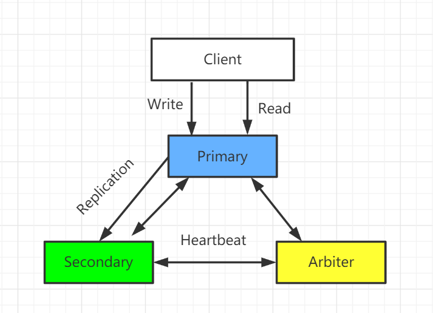

> 本文主要介绍了Linux环境下mongoDB副本集模式的搭建（一主一从一仲裁），具体包括了搭建步骤、主从切换、高可用测试等。
# 架构图

# 环境
- Ubuntu 5.4.0-6ubuntu1~16.04.12
- mongodb-linux-x86_64-ubuntu1604-4.2.8.tgz
# 步骤
## 创建主节点
1. 建立存放数据和日志的目录
```yml
# 主节点
mkdir -p /mongodb/replica_sets/rs_27017/log
mkdir -p /mongodb/replica_sets/rs_27017/data/db
```
2. 或修改配置文件
```yml
vim /mongodb/replica_sets/rs_27017/mongod.conf
```
```yml
systemLog:
    #MongoDB发送所有日志输出的目标指定为文件
    destination: file
    #mongod或mongos应向其发送所有诊断日志记录信息的日志文件的路径
    path: "/mongodb/replica_sets/rs_27017/log/mongod.log"
    #当mongos或mongod实例重新启动时，mongos或mongod会将新条目附加到现有日志文件的末尾
    logAppend: true
storage:
    #mongod实例存储其数据的目录。storage.dbPath设置仅适用于mongod
    dbPath: "/mongodb/replica_sets/rs_27017/data/db"
    journal:
         #启用或禁用持久性日志以确保数据文件保持有效和可恢复。    
        enabled: true
processManagement:  
    #启用在后台运行mongos或mongod进程的守护进程模式。
    fork: true  
    #指定用于保存mongos或mongod进程的进程ID的文件位置，其中mongos或mongod将写入其PID  
    pidFilePath: "/mongodb/replica_sets/rs_27017/log/mongod.pid"
net:  
    #服务实例绑定所有IP，有副作用，副本集初始化的时候，节点名字会自动设置为本地域名，而不是ip  
    #bindIpAll: true  
    #服务实例绑定的IP  
    bindIp: localhost,192.168.30.129 
    #bindIp  
    #绑定的端口  
    port: 27017
replication:  
    #副本集的名称  
    replSetName: kwz_rs
```
3. 启动节点服务：
 /usr/local/mongodb/bin/mongod -f /mongodb/replica_sets/rs_27017/mongod.conf

此处有一个错误：[Error parsing YAML config file: yaml-cpp: error at line 2, column 13: illegal map value](https://blog.csdn.net/lezeqe/article/details/90518179)，涉及到yml格式空格问题，参考这篇文章解决
## 创建副本级节点
1. 建立存放数据和日志的目录
```yml
# 主节点
mkdir -p /mongodb/replica_sets/rs_27018/log
mkdir -p /mongodb/replica_sets/rs_27018/data/db
```
2. 或修改配置文件
```yml
vim /mongodb/replica_sets/rs_27018/mongod.conf
```
```yml
systemLog:
    #MongoDB发送所有日志输出的目标指定为文件
    destination: file
    #mongod或mongos应向其发送所有诊断日志记录信息的日志文件的路径
    path: "/mongodb/replica_sets/rs_27018/log/mongod.log"
    #当mongos或mongod实例重新启动时，mongos或mongod会将新条目附加到现有日志文件的末尾
    logAppend: true
storage:
    #mongod实例存储其数据的目录。storage.dbPath设置仅适用于mongod
    dbPath: "/mongodb/replica_sets/rs_27018/data/db"
    journal:
         #启用或禁用持久性日志以确保数据文件保持有效和可恢复。
        enabled: true
processManagement:
    #启用在后台运行mongos或mongod进程的守护进程模式。
    fork: true
    #指定用于保存mongos或mongod进程的进程ID的文件位置，其中mongos或mongod将写入其PID
    pidFilePath: "/mongodb/replica_sets/rs_27018/log/mongod.pid"
net:
    #服务实例绑定所有IP，有副作用，副本集初始化的时候，节点名字会自动设置为本地域名，而不是ip
    #bindIpAll: true
    #服务实例绑定的IP
    bindIp: localhost,192.168.30.129
    #bindIp
    #绑定的端口
    port: 27018
replication:
    #副本集的名称
    replSetName: kwz_rs
```
3. 启动节点服务：
 /usr/local/mongodb/bin/mongod -f /mongodb/replica_sets/rs_27018/mongod.conf

## 创建仲裁节点
1. 建立存放数据和日志的目录
```yml
# 主节点
mkdir -p /mongodb/replica_sets/rs_27019/log
mkdir -p /mongodb/replica_sets/rs_27019/data/db
```
2. 或修改配置文件
```config
vim /mongodb/replica_sets/rs_27019/mongod.conf
```
```yml
systemLog:
    #MongoDB发送所有日志输出的目标指定为文件
    destination: file
    #mongod或mongos应向其发送所有诊断日志记录信息的日志文件的路径
    path: "/mongodb/replica_sets/rs_27018/log/mongod.log"
    #当mongos或mongod实例重新启动时，mongos或mongod会将新条目附加到现有日志文件的末尾
    logAppend: true
storage:
    #mongod实例存储其数据的目录。storage.dbPath设置仅适用于mongod
    dbPath: "/mongodb/replica_sets/rs_27018/data/db"
    journal:
         #启用或禁用持久性日志以确保数据文件保持有效和可恢复。
        enabled: true
processManagement:
    #启用在后台运行mongos或mongod进程的守护进程模式。
    fork: true
    #指定用于保存mongos或mongod进程的进程ID的文件位置，其中mongos或mongod将写入其PID
    pidFilePath: "/mongodb/replica_sets/rs_27018/log/mongod.pid"
net:
    #服务实例绑定所有IP，有副作用，副本集初始化的时候，节点名字会自动设置为本地域名，而不是ip
    #bindIpAll: true
    #服务实例绑定的IP
    bindIp: localhost,192.168.30.129
    #bindIp
    #绑定的端口
    port: 27018
replication:
    #副本集的名称
    replSetName: kwz_rs
```
3. 启动节点服务：
 /usr/local/mongodb/bin/mongod -f /mongodb/replica_sets/rs_27018/mongod.conf

## 初始化配置副本集和主节点
用客户端连接主节点（27017）
/usr/local/mongodb/bin/mongo --host=localhost --port=27017
连接成功之后，许多命令不能用，需要初始化副本集才行，使用默认的配置来初始化副本集：
**rs.initiate()**
```yml
{
        "info2" : "no configuration specified. Using a default configuration for the set",
        "me" : "localhost:27017",
        "ok" : 1,
        "$clusterTime" : {
                "clusterTime" : Timestamp(1601049270, 1),
                "signature" : {
                        "hash" : BinData(0,"AAAAAAAAAAAAAAAAAAAAAAAAAAA="),
                        "keyId" : NumberLong(0)
                }
        },
        "operationTime" : Timestamp(1601049270, 1)
}
kwz_rs:SECONDARY>
kwz_rs:SECONDARY>
kwz_rs:PRIMARY>
```
1. “ok”的值为1则说明创建成功 
2. 命令行提示符发生变化，变成了一个从节点角色，此时默认不能读写。稍等片刻，回车，变成主节 点，如上图显示的
这时候执行show dbs就有数据了：
```yml
kwz_rs:PRIMARY> show dbs;
admin   0.000GB
config  0.000GB
local   0.000GB
```
## 查看副本集的配置
在27017上执行副本集中当前节点的默认节点配置
```yml
kwz_rs:PRIMARY> rs.config()
{
		# 副本集配置数据存储的主键值，默认就是副本集的名字
        "_id" : "kwz_rs",
        "version" : 1,
        "protocolVersion" : NumberLong(1),
        "writeConcernMajorityJournalDefault" : true,
        # 副本集成员数组,此时只有27017一个
        "members" : [
                {
                        "_id" : 0,
                        "host" : "localhost:27017",
                        # 该成员不 是仲裁节点
                        "arbiterOnly" : false,
                        "buildIndexes" : true,
                        "hidden" : false,
                        # 优先级（权重值）
                        "priority" : 1,
                        "tags" : {

                        },
                        "slaveDelay" : NumberLong(0),
                        "votes" : 1
                }
        ],
        # 副本集的参数配置
        "settings" : {
                "chainingAllowed" : true,
                "heartbeatIntervalMillis" : 2000,
                "heartbeatTimeoutSecs" : 10,
                "electionTimeoutMillis" : 10000,
                "catchUpTimeoutMillis" : -1,
                "catchUpTakeoverDelayMillis" : 30000,
                "getLastErrorModes" : {

                },
                "getLastErrorDefaults" : {
                        "w" : 1,
                        "wtimeout" : 0
                },
                "replicaSetId" : ObjectId("5f6e12b681a01e73db9b210a")
        }
}
```
值得注意的是 副本集rs.conf()的查看命令，本质查询的是 system.replset 的表中的数据，它是在local库下面
## 查看副本集状态 
检查副本集状态，从其他成员发送的心跳包中获得的数据反映副本集的当前状态，通过rs.status()命令
在27017上查看副本集状态：
```yml
kwz_rs:PRIMARY> rs.status()
{
		# 副本集的名字
        "set" : "kwz_rs",
        "date" : ISODate("2020-09-25T16:38:25.293Z"),
        # 状态正常
        "myState" : 1,
        "term" : NumberLong(1),
        "syncingTo" : "",
        "syncSourceHost" : "",
        "syncSourceId" : -1,
        "heartbeatIntervalMillis" : NumberLong(2000),
        "majorityVoteCount" : 1,
        "writeMajorityCount" : 1,
        "optimes" : {
                "lastCommittedOpTime" : {
                        "ts" : Timestamp(1601051900, 1),
                        "t" : NumberLong(1)
                },
                "lastCommittedWallTime" : ISODate("2020-09-25T16:38:20.800Z"),
                "readConcernMajorityOpTime" : {
                        "ts" : Timestamp(1601051900, 1),
                        "t" : NumberLong(1)
                },
                "readConcernMajorityWallTime" : ISODate("2020-09-25T16:38:20.800Z"),
                "appliedOpTime" : {
                        "ts" : Timestamp(1601051900, 1),
                        "t" : NumberLong(1)
                },
                "durableOpTime" : {
                        "ts" : Timestamp(1601051900, 1),
                        "t" : NumberLong(1)
                },
                "lastAppliedWallTime" : ISODate("2020-09-25T16:38:20.800Z"),
                "lastDurableWallTime" : ISODate("2020-09-25T16:38:20.800Z")
        },
        "lastStableRecoveryTimestamp" : Timestamp(1601051850, 1),
        "lastStableCheckpointTimestamp" : Timestamp(1601051850, 1),
        "electionCandidateMetrics" : {
                "lastElectionReason" : "electionTimeout",
                "lastElectionDate" : ISODate("2020-09-25T15:54:30.537Z"),
                "electionTerm" : NumberLong(1),
                "lastCommittedOpTimeAtElection" : {
                        "ts" : Timestamp(0, 0),
                        "t" : NumberLong(-1)
                },
                "lastSeenOpTimeAtElection" : {
                        "ts" : Timestamp(1601049270, 1),
                        "t" : NumberLong(-1)
                },
                "numVotesNeeded" : 1,
                "priorityAtElection" : 1,
                "electionTimeoutMillis" : NumberLong(10000),
                "newTermStartDate" : ISODate("2020-09-25T15:54:30.567Z"),
                "wMajorityWriteAvailabilityDate" : ISODate("2020-09-25T15:54:30.580Z")
        },
        # 副本集成员数组
        "members" : [
                {
                        "_id" : 0,
                        "name" : "localhost:27017",
                        # 健康
                        "health" : 1,
                        "state" : 1,
                        # 主节点
                        "stateStr" : "PRIMARY",
                        "uptime" : 89235,
                        "optime" : {
                                "ts" : Timestamp(1601051900, 1),
                                "t" : NumberLong(1)
                        },
                        "optimeDate" : ISODate("2020-09-25T16:38:20Z"),
                        "syncingTo" : "",
                        "syncSourceHost" : "",
                        "syncSourceId" : -1,
                        "infoMessage" : "",
                        "electionTime" : Timestamp(1601049270, 2),
                        "electionDate" : ISODate("2020-09-25T15:54:30Z"),
                        "configVersion" : 1,
                        "self" : true,
                        "lastHeartbeatMessage" : ""
                }
        ],
        "ok" : 1,
        "$clusterTime" : {
                "clusterTime" : Timestamp(1601051900, 1),
                "signature" : {
                        "hash" : BinData(0,"AAAAAAAAAAAAAAAAAAAAAAAAAAA="),
                        "keyId" : NumberLong(0)
                }
        },
        "operationTime" : Timestamp(1601051900, 1)
}
```
## 添加副本从节点
在主节点添加从节点，将其他成员加入到副本集中
下面将27018的副本节点添加到副本集中：
```yml
kwz_rs:PRIMARY> rs.add("localhost:27018")
{
		# 说明添加成功
        "ok" : 1,
        "$clusterTime" : {
                "clusterTime" : Timestamp(1601053665, 1),
                "signature" : {
                        "hash" : BinData(0,"AAAAAAAAAAAAAAAAAAAAAAAAAAA="),
                        "keyId" : NumberLong(0)
                }
        },
        "operationTime" : Timestamp(1601053665, 1)
}
```
此时再次查看副本集状态：
```yml
kwz_rs:PRIMARY> rs.status()
{
        "set" : "kwz_rs",
        "date" : ISODate("2020-09-25T17:09:34.680Z"),
        "myState" : 1,
        "term" : NumberLong(1),
        "syncingTo" : "",
        "syncSourceHost" : "",
        "syncSourceId" : -1,
        "heartbeatIntervalMillis" : NumberLong(2000),
        "majorityVoteCount" : 2,
        "writeMajorityCount" : 2,
        "optimes" : {
                "lastCommittedOpTime" : {
                        "ts" : Timestamp(1601053770, 1),
                        "t" : NumberLong(1)
                },
                "lastCommittedWallTime" : ISODate("2020-09-25T17:09:30.959Z"),
                "readConcernMajorityOpTime" : {
                        "ts" : Timestamp(1601053770, 1),
                        "t" : NumberLong(1)
                },
                "readConcernMajorityWallTime" : ISODate("2020-09-25T17:09:30.959Z"),
                "appliedOpTime" : {
                        "ts" : Timestamp(1601053770, 1),
                        "t" : NumberLong(1)
                },
                "durableOpTime" : {
                        "ts" : Timestamp(1601053770, 1),
                        "t" : NumberLong(1)
                },
                "lastAppliedWallTime" : ISODate("2020-09-25T17:09:30.959Z"),
                "lastDurableWallTime" : ISODate("2020-09-25T17:09:30.959Z")
        },
        "lastStableRecoveryTimestamp" : Timestamp(1601053770, 1),
        "lastStableCheckpointTimestamp" : Timestamp(1601053770, 1),
        "electionCandidateMetrics" : {
                "lastElectionReason" : "electionTimeout",
                "lastElectionDate" : ISODate("2020-09-25T15:54:30.537Z"),
                "electionTerm" : NumberLong(1),
                "lastCommittedOpTimeAtElection" : {
                        "ts" : Timestamp(0, 0),
                        "t" : NumberLong(-1)
                },
                "lastSeenOpTimeAtElection" : {
                        "ts" : Timestamp(1601049270, 1),
                        "t" : NumberLong(-1)
                },
                "numVotesNeeded" : 1,
                "priorityAtElection" : 1,
                "electionTimeoutMillis" : NumberLong(10000),
                "newTermStartDate" : ISODate("2020-09-25T15:54:30.567Z"),
                "wMajorityWriteAvailabilityDate" : ISODate("2020-09-25T15:54:30.580Z")
        },
        # 副本集成员数组中现在有两个了
        "members" : [
                {
                        "_id" : 0,
                        "name" : "localhost:27017",
                        "health" : 1,
                        "state" : 1,
                        "stateStr" : "PRIMARY",
                        "uptime" : 91104,
                        "optime" : {
                                "ts" : Timestamp(1601053770, 1),
                                "t" : NumberLong(1)
                        },
                        "optimeDate" : ISODate("2020-09-25T17:09:30Z"),
                        "syncingTo" : "",
                        "syncSourceHost" : "",
                        "syncSourceId" : -1,
                        "infoMessage" : "",
                        "electionTime" : Timestamp(1601049270, 2),
                        "electionDate" : ISODate("2020-09-25T15:54:30Z"),
                        "configVersion" : 2,
                        "self" : true,
                        "lastHeartbeatMessage" : ""
                },
                {
                        "_id" : 1,
                        # 第二个节点的名字
                        "name" : "localhost:27018",
                        "health" : 1,
                        "state" : 2,
                        # 它的角色是SECONDARY
                        "stateStr" : "SECONDARY",
                        "uptime" : 109,
                        "optime" : {
                                "ts" : Timestamp(1601053770, 1),
                                "t" : NumberLong(1)
                        },
                        "optimeDurable" : {
                                "ts" : Timestamp(1601053770, 1),
                                "t" : NumberLong(1)
                        },
                        "optimeDate" : ISODate("2020-09-25T17:09:30Z"),
                        "optimeDurableDate" : ISODate("2020-09-25T17:09:30Z"),
                        "lastHeartbeat" : ISODate("2020-09-25T17:09:33.236Z"),
                        "lastHeartbeatRecv" : ISODate("2020-09-25T17:09:34.403Z"),
                        "pingMs" : NumberLong(0),
                        "lastHeartbeatMessage" : "",
                        "syncingTo" : "localhost:27017",
                        "syncSourceHost" : "localhost:27017",
                        "syncSourceId" : 0,
                        "infoMessage" : "",
                        "configVersion" : 2
                }
        ],
        "ok" : 1,
        "$clusterTime" : {
                "clusterTime" : Timestamp(1601053770, 1),
                "signature" : {
                        "hash" : BinData(0,"AAAAAAAAAAAAAAAAAAAAAAAAAAA="),
                        "keyId" : NumberLong(0)
                }
        },
        "operationTime" : Timestamp(1601053770, 1)
}
```
## 添加仲裁从节点
将27019作为仲裁节点，添加到副本集中：
```yml
kwz_rs:PRIMARY> rs.addArb("localhost:27019")
{
        "ok" : 1,
        "$clusterTime" : {
                "clusterTime" : Timestamp(1601054101, 1),
                "signature" : {
                        "hash" : BinData(0,"AAAAAAAAAAAAAAAAAAAAAAAAAAA="),
                        "keyId" : NumberLong(0)
                }
        },
        "operationTime" : Timestamp(1601054101, 1)
}
```
查看副本集状态：
```yml
kwz_rs:PRIMARY> rs.status()
{
        "set" : "kwz_rs",
        "date" : ISODate("2020-09-25T17:15:46.933Z"),
        "myState" : 1,
        "term" : NumberLong(1),
        "syncingTo" : "",
        "syncSourceHost" : "",
        "syncSourceId" : -1,
        "heartbeatIntervalMillis" : NumberLong(2000),
        "majorityVoteCount" : 2,
        "writeMajorityCount" : 2,
        "optimes" : {
                "lastCommittedOpTime" : {
                        "ts" : Timestamp(1601054140, 1),
                        "t" : NumberLong(1)
                },
                "lastCommittedWallTime" : ISODate("2020-09-25T17:15:40.991Z"),
                "readConcernMajorityOpTime" : {
                        "ts" : Timestamp(1601054140, 1),
                        "t" : NumberLong(1)
                },
                "readConcernMajorityWallTime" : ISODate("2020-09-25T17:15:40.991Z"),
                "appliedOpTime" : {
                        "ts" : Timestamp(1601054140, 1),
                        "t" : NumberLong(1)
                },
                "durableOpTime" : {
                        "ts" : Timestamp(1601054140, 1),
                        "t" : NumberLong(1)
                },
                "lastAppliedWallTime" : ISODate("2020-09-25T17:15:40.991Z"),
                "lastDurableWallTime" : ISODate("2020-09-25T17:15:40.991Z")
        },
        "lastStableRecoveryTimestamp" : Timestamp(1601054130, 1),
        "lastStableCheckpointTimestamp" : Timestamp(1601054130, 1),
        "electionCandidateMetrics" : {
                "lastElectionReason" : "electionTimeout",
                "lastElectionDate" : ISODate("2020-09-25T15:54:30.537Z"),
                "electionTerm" : NumberLong(1),
                "lastCommittedOpTimeAtElection" : {
                        "ts" : Timestamp(0, 0),
                        "t" : NumberLong(-1)
                },
                "lastSeenOpTimeAtElection" : {
                        "ts" : Timestamp(1601049270, 1),
                        "t" : NumberLong(-1)
                },
                "numVotesNeeded" : 1,
                "priorityAtElection" : 1,
                "electionTimeoutMillis" : NumberLong(10000),
                "newTermStartDate" : ISODate("2020-09-25T15:54:30.567Z"),
                "wMajorityWriteAvailabilityDate" : ISODate("2020-09-25T15:54:30.580Z")
        },
        # 副本集成员数组中现在有三个了
        "members" : [
                {
                        "_id" : 0,
                        "name" : "localhost:27017",
                        "health" : 1,
                        "state" : 1,
                        "stateStr" : "PRIMARY",
                        "uptime" : 91476,
                        "optime" : {
                                "ts" : Timestamp(1601054140, 1),
                                "t" : NumberLong(1)
                        },
                        "optimeDate" : ISODate("2020-09-25T17:15:40Z"),
                        "syncingTo" : "",
                        "syncSourceHost" : "",
                        "syncSourceId" : -1,
                        "infoMessage" : "",
                        "electionTime" : Timestamp(1601049270, 2),
                        "electionDate" : ISODate("2020-09-25T15:54:30Z"),
                        "configVersion" : 3,
                        "self" : true,
                        "lastHeartbeatMessage" : ""
                },
                {
                        "_id" : 1,
                        "name" : "localhost:27018",
                        "health" : 1,
                        "state" : 2,
                        "stateStr" : "SECONDARY",
                        "uptime" : 481,
                        "optime" : {
                                "ts" : Timestamp(1601054140, 1),
                                "t" : NumberLong(1)
                        },
                        "optimeDurable" : {
                                "ts" : Timestamp(1601054140, 1),
                                "t" : NumberLong(1)
                        },
                        "optimeDate" : ISODate("2020-09-25T17:15:40Z"),
                        "optimeDurableDate" : ISODate("2020-09-25T17:15:40Z"),
                        "lastHeartbeat" : ISODate("2020-09-25T17:15:45.481Z"),
                        "lastHeartbeatRecv" : ISODate("2020-09-25T17:15:45.505Z"),
                        "pingMs" : NumberLong(0),
                        "lastHeartbeatMessage" : "",
                        "syncingTo" : "localhost:27017",
                        "syncSourceHost" : "localhost:27017",
                        "syncSourceId" : 0,
                        "infoMessage" : "",
                        "configVersion" : 3
                },
                {
                        "_id" : 2,
                        "name" : "localhost:27019",
                        "health" : 1,
                        "state" : 7,
                        "stateStr" : "ARBITER",
                        "uptime" : 45,
                        "lastHeartbeat" : ISODate("2020-09-25T17:15:45.492Z"),
                        "lastHeartbeatRecv" : ISODate("2020-09-25T17:15:45.510Z"),
                        "pingMs" : NumberLong(0),
                        "lastHeartbeatMessage" : "",
                        "syncingTo" : "",
                        "syncSourceHost" : "",
                        "syncSourceId" : -1,
                        "infoMessage" : "",
                        "configVersion" : 3
                }
        ],
        "ok" : 1,
        "$clusterTime" : {
                "clusterTime" : Timestamp(1601054140, 1),
                "signature" : {
                        "hash" : BinData(0,"AAAAAAAAAAAAAAAAAAAAAAAAAAA="),
                        "keyId" : NumberLong(0)
                }
        },
        "operationTime" : Timestamp(1601054140, 1)
}

```
# 副本集数据读写测试
## 主节点写入和读取数据
**登陆27017主节点，进行写入和读取数据操作：**
```yml
/usr/local/mongodb/bin/mongo --host localhost --port 27017
```
```yml
kwz_rs:PRIMARY> use article
switched to db article
kwz_rs:PRIMARY> db
article
kwz_rs:PRIMARY> db.comment.insert({"articleid":"001","content":"本篇论文纯属虚构","userId":"1001","nickName":"hanhan","createDatetime":new Date()})
WriteResult({ "nInserted" : 1 })
kwz_rs:PRIMARY> db.comment.find()
{ "_id" : ObjectId("5f6f07a88c6d2fbab4118f14"), "articleid" : "001", "content" : "本篇论文纯属虚构", "userId" : "1001", "nickName" : "hanhan", "createDatetime" : ISODate("2020-09-26T09:19:36.729Z") }
```
如上所示，我们在27017主节点进行插入和读取操作，均正常
## 从节点写入和读取数据
登陆27018从节点，进行写入和读取数据操作
```yml
/usr/local/mongodb/bin/mongo --host localhost --port 27018
```
```
kwz_rs:SECONDARY> show dbs
2020-09-26T17:27:32.202+0800 E  QUERY    [js] uncaught exception: Error: listDatabases failed:{
        "operationTime" : Timestamp(1601112444, 1),
        "ok" : 0,
        "errmsg" : "not master and slaveOk=false",
        "code" : 13435,
        "codeName" : "NotMasterNoSlaveOk",
        "$clusterTime" : {
                "clusterTime" : Timestamp(1601112444, 1),
                "signature" : {
                        "hash" : BinData(0,"AAAAAAAAAAAAAAAAAAAAAAAAAAA="),
                        "keyId" : NumberLong(0)
                }
        }
} :
_getErrorWithCode@src/mongo/shell/utils.js:25:13
Mongo.prototype.getDBs/<@src/mongo/shell/mongo.js:135:19
Mongo.prototype.getDBs@src/mongo/shell/mongo.js:87:12
shellHelper.show@src/mongo/shell/utils.js:906:13
shellHelper@src/mongo/shell/utils.js:790:15
@(shellhelp2):1:1
```
可以发现不能读取集合的数据，有个"errmsg" : "not master and slaveOk=false",可见当前节点只是数据的一个备份，不是slave节点，无法读取数据，写入当然更不行。默认情况下，从节点是没有读写权限的，可以增加读的权限，但需要进行设置。
设置读操作权限，允许从成员上进行读的操作：
```yml
rs.slaveOk()或者rs.slaveOk(true)
```
同理，如果想取消从节点的读取权限，设置为：
```yml
rs.slaveOk(false)
```
这时候再看一下，就有了：
```yml
kwz_rs:SECONDARY> show dbs
admin    0.000GB
article  0.000GB
config   0.000GB
local    0.000GB
```
```yml
kwz_rs:SECONDARY> use article
switched to db article
kwz_rs:SECONDARY> show collections
comment
kwz_rs:SECONDARY> db.comment.find()
{ "_id" : ObjectId("5f6f07a88c6d2fbab4118f14"), "articleid" : "001", "content" : "本篇论文纯属虚构", "userId" : "1001", "nickName" : "hanhan", "createDatetime" : ISODate("2020-09-26T09:19:36.729Z") }
kwz_rs:SECONDARY> db.comment.insert({"articleid":"002","content":"本篇论文纯属虚构","userId":"1001","nickName":"hanhan","createDatetime":new Date()})
WriteCommandError({
        "operationTime" : Timestamp(1601112924, 1),
        "ok" : 0,
        "errmsg" : "not master",
        "code" : 10107,
        "codeName" : "NotMaster",
        "$clusterTime" : {
                "clusterTime" : Timestamp(1601112924, 1),
                "signature" : {
                        "hash" : BinData(0,"AAAAAAAAAAAAAAAAAAAAAAAAAAA="),
                        "keyId" : NumberLong(0)
                }
        }
})
```
## 仲裁节点查看
登陆27019仲裁节点
```yml
kwz_rs:ARBITER> rs.slaveOk()
kwz_rs:ARBITER> show dbs
local  0.000GB
kwz_rs:ARBITER> use local
switched to db local
kwz_rs:ARBITER> show collections
replset.election
replset.minvalid
replset.oplogTruncateAfterPoint
startup_log
system.replset
system.rollback.id
kwz_rs:ARBITER>
```
可见仲裁节点不存放任何业务数据，只存放了副本集配置等数据
# 主节点的选举原则
MongoDB在副本集中，会自动进行主节点的选举，触发主节点选举的条件主要有三个，分别为：
- 主节点故障
- 主节点网络不可达（默认心跳时间为10s，超过10s即认为网络不可达）
- 人工干预

一旦触发选举 ，会根据一定规则进行主节点的选举，选举规则是根据票数的多少来决定的
- 票数最高，则获胜
- 若票数相同，且都获得了“大多数”成员的投票支持的，此时，数据新的节点会获胜，数据的新旧是通过操作日志oplog进行对比的

副本集配置中的priority（优先级）对投票选举影响极大，一般情况下默认为1，它的可选范围是0-1000，相当于额外增加了0-1000票数，指定较高的值，使成员更有资格成为主要成员，更低的值可使成员更不符合条件， 通过rs.conf()可以看到集群优先级的配置。一般主节点和副本节点的优先级各为1，默认都有一票，而仲裁节点的优先级必须是0，不能为别的值。它不具备选举权，但是具备投票权（这也很好理解，仲裁节点你都没有数据，怎么可能给你选举权呢）。 
## 优先级的设置
- 查看副本级配置
```yml
kwz_rs:PRIMARY> rs.conf()
{
        "_id" : "kwz_rs",
        "version" : 3,
        "protocolVersion" : NumberLong(1),
        "writeConcernMajorityJournalDefault" : true,
        "members" : [
                {
                        "_id" : 0,
                        "host" : "localhost:27017",
                        "arbiterOnly" : false,
                        "buildIndexes" : true,
                        "hidden" : false,
                        "priority" : 1,
                        "tags" : {

                        },
                        "slaveDelay" : NumberLong(0),
                        "votes" : 1
                },
                {
                        "_id" : 1,
                        "host" : "localhost:27018",
                        "arbiterOnly" : false,
                        "buildIndexes" : true,
                        "hidden" : false,
                        "priority" : 1,
                        "tags" : {

                        },
                        "slaveDelay" : NumberLong(0),
                        "votes" : 1
                },
                {
                        "_id" : 2,
                        "host" : "localhost:27019",
                        "arbiterOnly" : true,
                        "buildIndexes" : true,
                        "hidden" : false,
                        "priority" : 0,
                        "tags" : {

                        },
                        "slaveDelay" : NumberLong(0),
                        "votes" : 1
                }
        ],
        "settings" : {
                "chainingAllowed" : true,
                "heartbeatIntervalMillis" : 2000,
                "heartbeatTimeoutSecs" : 10,
                "electionTimeoutMillis" : 10000,
                "catchUpTimeoutMillis" : -1,
                "catchUpTakeoverDelayMillis" : 30000,
                "getLastErrorModes" : {

                },
                "getLastErrorDefaults" : {
                        "w" : 1,
                        "wtimeout" : 0
                },
                "replicaSetId" : ObjectId("5f6e12b681a01e73db9b210a")
        }
}
```
可以看到27018副本级节点原来的优先级1，现在我们将它改为2，让它默认有2票
- 将配置导入conf_temp
```yml
conf_temp=rs.config()
```
- 将27018副本节点优先级设为2（这里数组的index默认是从0开始的）
```yml
conf_temp.members[1].priority=2
```
- 重新加载conf_temp配置
```yml
kwz_rs:PRIMARY> rs.reconfig(conf_temp)
{
        "ok" : 1,
        "$clusterTime" : {
                "clusterTime" : Timestamp(1601130737, 1),
                "signature" : {
                        "hash" : BinData(0,"AAAAAAAAAAAAAAAAAAAAAAAAAAA="),
                        "keyId" : NumberLong(0)
                }
        },
        "operationTime" : Timestamp(1601130737, 1)
}
```
- 再次查看副本集配置信息
```yml
kwz_rs:PRIMARY> rs.conf()
{
        "_id" : "kwz_rs",
        "version" : 4,
        "protocolVersion" : NumberLong(1),
        "writeConcernMajorityJournalDefault" : true,
        "members" : [
                {
                        "_id" : 0,
                        "host" : "localhost:27017",
                        "arbiterOnly" : false,
                        "buildIndexes" : true,
                        "hidden" : false,
                        "priority" : 1,
                        "tags" : {

                        },
                        "slaveDelay" : NumberLong(0),
                        "votes" : 1
                },
                {
                        "_id" : 1,
                        "host" : "localhost:27018",
                        "arbiterOnly" : false,
                        "buildIndexes" : true,
                        "hidden" : false,
                        "priority" : 2,
                        "tags" : {

                        },
                        "slaveDelay" : NumberLong(0),
                        "votes" : 1
                },
                {
                        "_id" : 2,
                        "host" : "localhost:27019",
                        "arbiterOnly" : true,
                        "buildIndexes" : true,
                        "hidden" : false,
                        "priority" : 0,
                        "tags" : {

                        },
                        "slaveDelay" : NumberLong(0),
                        "votes" : 1
                }
        ],
        "settings" : {
                "chainingAllowed" : true,
                "heartbeatIntervalMillis" : 2000,
                "heartbeatTimeoutSecs" : 10,
                "electionTimeoutMillis" : 10000,
                "catchUpTimeoutMillis" : -1,
                "catchUpTakeoverDelayMillis" : 30000,
                "getLastErrorModes" : {

                },
                "getLastErrorDefaults" : {
                        "w" : 1,
                        "wtimeout" : 0
                },
                "replicaSetId" : ObjectId("5f6e12b681a01e73db9b210a")
        }
}
```
可以看到27018节点的优先级已经变为2了
# 高可用测试
## 副本节点选举为主节点测试
如上所示，当副本节点的priority大于主节点的priority，此时，27017的主节点自动蜕变为副本节点，而27018的副本节点被选举为主节点，完成切换
## 副本节点故障测试
关闭27018副本节点、此时主节点还在，没有触发选举操作。此时，往主节点里面插入数据：
```yml
db.comment.insert({"_id":"4","articleid":"100001","content":"秋天里的第一杯奶茶","userId":"1002","nickName":"去苏州一起喝","createDatetime":new Date("2019-0805T22:08:15.522Z"),"likeNum":NumberInt(1000)})
WriteResult({ "nInserted" : 1 })
```
再次启动27018副本节点：
```yml 
/usr/local/mongodb/bin/mongod -f  /mongodb/replica_sets/rs_27018/mongod.conf
```
此时，之前27017主节点同步的数据同步过来了
```yml
kwz_rs:SECONDARY> db.comment.find()
{ "_id" : "4", "articleid" : "100001", "content" : "秋天里的第一杯奶茶", "userId" : "1002", "nickName" : "去苏州一起喝", "createDatetime" : ISODate("1970-01-01T00:00:00Z"), "likeNum" : 1000 }
{ "_id" : ObjectId("5f6f5dc39ef50a5bad627ea5") }
{ "_id" : ObjectId("5f6f5db29ef50a5bad627ea4") }
```
## 主节点故障测试
此时关闭27017主节点，从节点和仲裁节点对27017的心跳失败，当失败超过10秒，此时因为没有主节点了，会自动发起投票进行主节点的选取，副本节点只有27018，27019仲裁节点只有投票权没有选举权，因此27019仲裁节点投一票给27018，27018自带一票，共两票。被选举为主节点，此时具备了读写功能，如下：
```yml
kwz_rs:PRIMARY> db.comment.insert({"_id":"5","articleid":"100001","content":"秋天里的第一杯奶茶","userId":"1002","nickName":"去苏州一起喝","createDatetime":new Date("2019-0805T22:08:15.522Z"),"likeNum":NumberInt(1000)})
WriteResult({ "nInserted" : 1 })
```
## 仲裁节点和主节点故障测试
演示仲裁节点和主节点故障，步骤如下：
1. 先恢复一主一从一仲裁
2. 关掉仲裁节点27019
3. 关掉主节点27018

此时登陆27017节点，发现27017还是从节点，副本集现在没有主节点了，现在副本集是只读状态，无法进行写入操作了
此时如果想触发主节点的选举，再加入一个成员即可
- 如果只加入27019仲裁节点成员，则主节点一定是27017，因为没得选了，仲裁节点不参与选举， 但参与投票
- 如果只加入27018节点，会发起选举。因为27017和27018都是两票，则按照谁数据新，谁当主节点 
## 仲裁节点和从节点故障测试
- 先恢复一主一从一仲裁
- 关掉仲裁节点27019
- 关掉现在的副本节点27018

等待10s后，27017主节点自动降级为副本节点了。
# 小结
本篇文章主要介绍了Linux环境下mongoDB 4副本集模式搭建步骤以及它的选举规则，在搭建完之后又分别进行了高可用测试。

参考：
1. [https://www.bilibili.com/video/BV14Z4y1p7Xu?p=29](https://www.bilibili.com/video/BV14Z4y1p7Xu?p=29)
2. [https://github.com/nuptkwz/notes/tree/master/technology/mongo](https://github.com/nuptkwz/notes/tree/master/technology/mongo)
