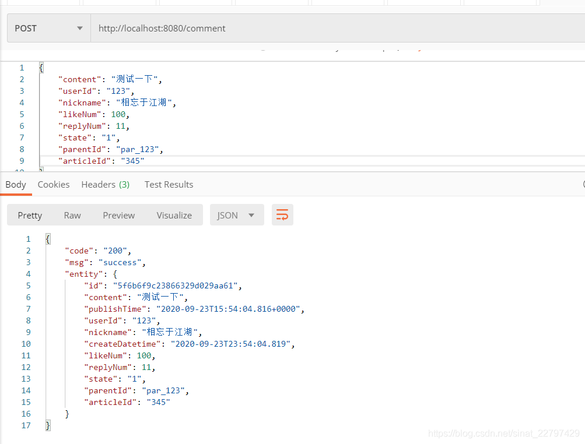
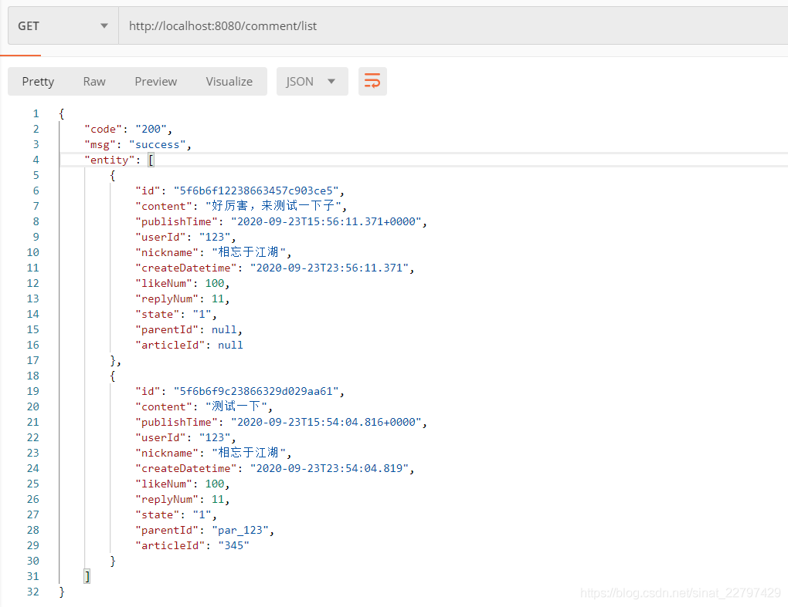

# 前言
>本文介绍了SpringBoot集成了MongoDB，利用SpringDataMongodb操作文章的评论的增、删、改、查过程。
# 环境
- spring-boot（2.1.6）
- mongodb(4.2.8)
- spring-boot-starter-data-mongodb
- IntelliJ IDEA (2019)
# 微服务模块搭建
## 搭建SpringBoot项目
比较简单，不再赘述
## 引入pom.xm
主要的包是spring-boot-starter-parent、spring-boot-starter-web、spring-boot-starter-data-mongodb，如下：
```xml
<?xml version="1.0" encoding="UTF-8"?>
<project xmlns="http://maven.apache.org/POM/4.0.0" xmlns:xsi="http://www.w3.org/2001/XMLSchema-instance"
         xsi:schemaLocation="http://maven.apache.org/POM/4.0.0 https://maven.apache.org/xsd/maven-4.0.0.xsd">
    <modelVersion>4.0.0</modelVersion>
    <parent>
        <groupId>org.springframework.boot</groupId>
        <artifactId>spring-boot-starter-parent</artifactId>
        <version>2.1.6.RELEASE</version>
        <relativePath/> <!-- lookup parent from repository -->
    </parent>
    <groupId>com.mongo</groupId>
    <artifactId>springboot-mongo</artifactId>
    <version>0.0.1-SNAPSHOT</version>
    <name>springboot-mongo</name>
    <description>Demo project for Spring Boot connect mongoDB</description>

    <properties>
        <java.version>1.8</java.version>
    </properties>

    <dependencies>
        <dependency>
            <groupId>org.springframework.boot</groupId>
            <artifactId>spring-boot-starter</artifactId>
        </dependency>
        <dependency>
            <groupId>org.projectlombok</groupId>
            <artifactId>lombok</artifactId>
            <optional>true</optional>
        </dependency>
        <dependency>
            <groupId>org.springframework.boot</groupId>
            <artifactId>spring-boot-starter-web</artifactId>
        </dependency>
        <dependency>
            <groupId>org.springframework.boot</groupId>
            <artifactId>spring-boot-starter-data-mongodb</artifactId>
        </dependency>
        <dependency>
            <groupId>org.springframework.boot</groupId>
            <artifactId>spring-boot-starter-test</artifactId>
            <scope>test</scope>
            <exclusions>
                <exclusion>
                    <groupId>org.junit.vintage</groupId>
                    <artifactId>junit-vintage-engine</artifactId>
                </exclusion>
            </exclusions>
        </dependency>
    </dependencies>

    <build>
        <plugins>
            <plugin>
                <groupId>org.springframework.boot</groupId>
                <artifactId>spring-boot-maven-plugin</artifactId>
            </plugin>
        </plugins>
    </build>

</project>
```
## 配置application.yml
我搭的mongodb没加密码，比较简单的配置，可以通过官网提供的方式，也可以通过uri的方式，如下：
```yml
spring:
  data:
    mongodb:
      #主机地址
      host: 192.168.30.129
      database: article
      port: 27017
      #uri方式
      # uri: mongodb://192.168.30.129/article
```
## 评论实体类
评论的实体如下，我创建了一个复合索引，@CompoundIndex(def = "{'userId':1,'nickName':-1}")，它是名字和别名组成的，因为这两个基本一块用的，复合索引可以减少一个索引开销
```java
package com.mongo.springbootmongo.entity;

import lombok.Data;
import org.springframework.data.annotation.Id;
import org.springframework.data.mongodb.core.index.CompoundIndex;
import org.springframework.data.mongodb.core.index.Indexed;
import org.springframework.data.mongodb.core.mapping.Document;
import org.springframework.data.mongodb.core.mapping.Field;

import java.time.LocalDateTime;
import java.util.Date;

@Document(collection="comment")
@CompoundIndex(def = "{'userId':1,'nickName':-1}")
@Data
public class Comment {
    @Id
    private String id;//主键  
    //该属性对应mongodb的字段的名字，如果一致，则无需该注解  
    @Field("content")
    private String content;
    private Date publishTime = new Date();
    @Indexed
    private String userId;
    private String nickname;
    private LocalDateTime createDatetime = LocalDateTime.now();
    private Integer likeNum;
    private Integer replyNum;
    private String state;
    private String parentId;
    private String articleId;
}
```
## Controller层代码
```
package com.mongo.springbootmongo.controller;

import com.mongo.springbootmongo.entity.Comment;
import com.mongo.springbootmongo.service.CommentService;
import com.mongo.springbootmongo.util.Result;
import lombok.Setter;
import org.springframework.beans.factory.annotation.Autowired;
import org.springframework.web.bind.annotation.*;

@RestController
@RequestMapping("comment")
public class CommentController {

    @Setter(onMethod_ = @Autowired)
    private CommentService commentService;

    @PostMapping
    public Result saveComment(@RequestBody Comment comment){

        return Result.success(commentService.saveComment(comment));
    }

    @GetMapping("/list")
    public Result get(){

        return Result.success(commentService.findCommentList());
    }
}

```
## Service层实现
service层实现提供了5个方法，分别为：saveComment（保存评论）、updateComment（更新评论）、deleteCommentById（删除评论）、findCommentList（查询评论列表）、findCommentById（通过id查询评论）
```java
package com.mongo.springbootmongo.service.impl;

import com.mongo.springbootmongo.dao.CommentRepository;
import com.mongo.springbootmongo.entity.Comment;
import com.mongo.springbootmongo.service.CommentService;
import lombok.RequiredArgsConstructor;
import org.springframework.stereotype.Service;

import java.util.List;
import java.util.Optional;

@Service
@RequiredArgsConstructor
public class CommentServiceImpl implements CommentService {

    private final CommentRepository commentRepository;

    @Override
    public Comment saveComment(Comment comment) {
        return commentRepository.save(comment);
    }

    @Override
    public void updateComment(Comment comment) {
        commentRepository.save(comment);
    }

    @Override
    public void deleteCommentById(String id) {
        commentRepository.deleteById(id);
    }

    @Override
    public List<Comment> findCommentList() {
        return commentRepository.findAll();
    }

    @Override
    public Optional<Comment> findCommentById(String id) {
        return commentRepository.findById(id);
    }

}
```
## DAO层
dao层直接继承了MongoRepository，比较简单
```java
package com.mongo.springbootmongo.dao;
import com.mongo.springbootmongo.entity.Comment;
import org.springframework.data.mongodb.repository.MongoRepository;

public interface CommentRepository extends MongoRepository<Comment,String> {

}
```
## 测试
本篇测试了两个接口，分别是保存评论和评论列表
- 保存评论

里面postman测试如下：

- 评论列表

# 总结
本文主要介绍了通过SpringDataMongoDB操作连接MongoDB操作数据库的过程

参考：
1. [https://github.com/nuptkwz/notes/blob/master/technology/mongo/Linux%E7%8E%AF%E5%A2%83%E4%B8%8BmongoDB%204%E6%90%AD%E5%BB%BA%EF%BC%88%E5%8D%95%E6%9C%BA%E6%A8%A1%E5%BC%8F%EF%BC%89.md](https://github.com/nuptkwz/notes/blob/master/technology/mongo)