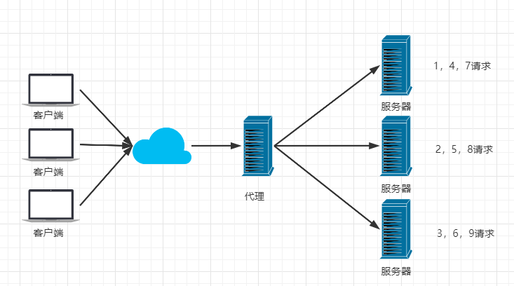
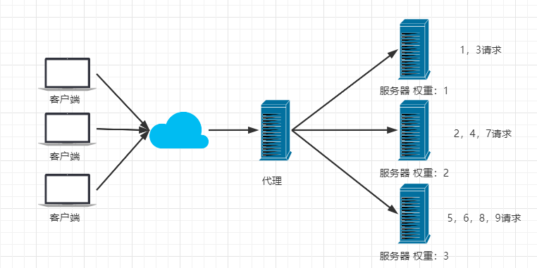
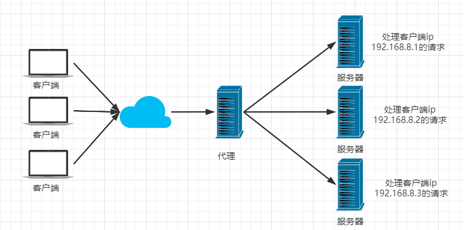

# 基本概念

Nginx (engine x) 是一个高性能的HTTP和反向代理web服务器，同时也提供了IMAP/POP3/SMTP服务。

# Nginx的作用

> Http代理，反向代理：作为web服务器最常用的功能之一，尤其是反向代理。

- 正向代理：代理了客户端
- 反向代理：代理了服务端

Nginx提供的负载均衡策略有2种：内置策略和扩展策略。内置策略为轮询，加权轮询，Ip hash。扩展策略，就天马行空，只有你想不到的没有他做不到的。

## nginx负载策略

1. 轮询

2. 加权轮询

加权轮询可以根据服务器资源的情况，有选择性的将请求打到资源相对好的服务器

3. iphash

iphash对客户端请求的ip进行hash操作，然后根据hash结果将同一个客户端ip的请求分发给同一台服务器进行处理，可以解决session不共享的问题。

# 参考文章

1. https://www.kuangstudy.com/bbs/1353634800149213186