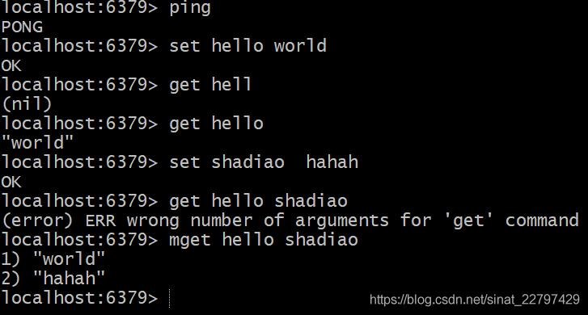

@[toc]
## redis是什么?
 - 开源
 - 基于键值的存储服务系统
 - 	多种数据结构
 - 高性能、功能丰富
## redis的优势?
 - 高性能Key - Value 服务器
 - 多种数据结构
 - 丰富的功能（pepeline、发布订阅、慢查询、GEO等）
 - 高可用分布式支持
redis在GitHub、twitter、stackoverflow、阿里、百度、微博、美团、搜狐等等公司广泛的应用。
## redis的特性
 - 速度快
 - 持久化
 - 多种数据结构
 - 支持多种编程语言
 - 功能丰富
 - 简单
 - 主从复制
 - 高可用、分布式
### 速度快
redis官方给出的数字是10w OPS也就是说每秒可以实现十万次的读写。那么redis为什么读取速度那么快呢？首先redis是存放在内存中的，其次redis是用C语言编写的，C语言是与操作系统较近的一种编程语言。最主要的原因还是redis把数据存放在内存中导致的。如下是存取速度快慢的图：

### 持久化
Redis所有数据保存在内存中，对数据的更新将异步地保存到磁盘上。
### 多种数据结构
redis主要包含了5种数据结构，分别为：
 - **字符串(String)**
 - **列表(List）**
 - **哈希(hash)**
 - **集合(Set)**
 - **有序集合(zSet)**

除了这5种数据结构以外，在新版本以及redis的迭代中还提供了其他的数据结构（衍生的数据结构），如：

 - BitMaps:位图
 - HyperLogLog:超小内存唯一值计数（通过一个非常小的内存如12k来进行一个唯一值的计数）
 - GEO：地理信息定位
### 其他功能
 - 发布订阅
 - Lua脚本
 - 支持简单的事务功能
 - 支持pipeline
### 主从复制

### 高可用、分布式
高可用     ->   利用Redis-Sentinel(v2.8)支持高可用
分布式     ->   Redis-Cluster(v3.0)支持分布式
### Redis典型应用场景
 - 缓存系统
 - 计数器（对业务进行一个计数，如微博转发数、评论数、视频点击数）
 - 消息队列系统（redis提供了发布订阅、阻塞队列来实现类似的功能）
 - 排行榜（redis提供了一个有序的集合可以实现排行榜这样的功能，如音乐排行榜、视频、游戏排行榜，粉丝数、关注数）
 - 社交网络
 - 实时系统（垃圾邮件过滤，实时系统处理）
## redis安装
 - redis安装
 - 可执行文件说明
 - 三种启动方法
 - 简单的客户端连接
### redis在Ubuntu环境下的安装
**1.进入redis官网下载redis**
wget http://download.redis.io/releases/redis-5.0.7.tar.gz
**2.解压**
tar -xvf redis-5.0.7.tar.gz
**3.建立一个软连接，方便后期的升级**
ln -s redis-5.0.7 redis
**4.进入目录**
cd redis
**5.编译和安装**
make&&make install

### redis可执行文件说明
我们进入到src目录下，可以看见几个可执行文件
**redis-server:**  可以启动Redis服务器
**redis-cli :**   Redis命令行客户端
**redis-benchmark :**   Redis性能测试工具
**redis-check-aof :**  AOF文件修复工具
**redis-check-dump:** RDB文件检查工具
**redis-sentinel:** Sentinel服务器（2.8以后）
### 启动方式
主要分为三种启动方式，最简启动、动态参数启动、配置文件启动
 - **最简启动**
./redis-server来启动
**验证方法：**
ps -ef | grep redis（查看进程方式进行验证）
netstat -antpl | grep redis(查看端口方式进行验证) 
redis-cli -h ip -p port ping
 - **动态参数启动**
redis-server --port 6380(指定默认端口启动redis，默认端口是6379)
 - **配置文件启动**
redis-server configPath(使用配置文件的方式启动)
新建一个config文件夹，将redis.config复制到文件夹里面的redis-6381.conf，不看配置文件中的#和空格：
cat redis-6381.conf | grep -v "#" | grep -v "^$"
将它追加到redis-6382.conf里面
### 三种启动的比较
 - 生产环境选择配置启动
 - 单机多实例配置文件可以用端口区分开
### redis客户端连接
redis-cli -h xxx.xxx.xx.xxx -p 6381
连接完成后可以使用简单的命令，ping通后可以返回一个PONG，表示成功了。get命令是获取字符串的命令，而hget是获取hash的命

## redis常用配置
**daemonize:**  是否是守护进程（no|yes）
**port:** redis对外端口号（单机多实例的时代需要配置的）
**logfile:** redis系统日志
**dir:** redis工作目录（日志、持久化文件等存放地方）
初次之外，redis还有许多其他的配置如RDB config、AOF config、slow Log conig、maxMemory等等
# 搭建过程遇到的问题
1. /bin/sh:cc: 未找到命令
```
make[1]: 进入目录“/home/redis/redis-5.0.7/src”
    CC adlist.o
/bin/sh: cc: 未找到命令
```
原因是没有安装gcc
解决方式：
```
//在线安装gcc
yum install gcc-c++ -y
```
2. zmalloc.h:50:31: 致命错误：jemalloc/jemalloc.h：没有那个文件或目录
参考：[zmalloc.h:50:31: 致命错误：jemalloc/jemalloc.h：没有那个文件或目录](https://blog.csdn.net/gwd1154978352/article/details/74784368)

3. Redis主从复制踩坑：Error condition on socket for SYNC: No route to host
[Redis主从复制踩坑：Error condition on socket for SYNC: No route to host](https://blog.csdn.net/qq_41432730/article/details/121585753)